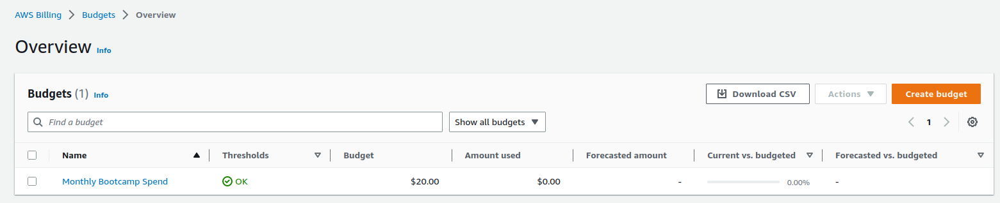
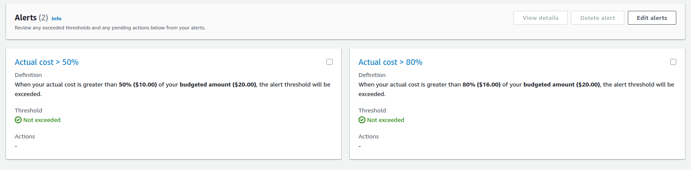
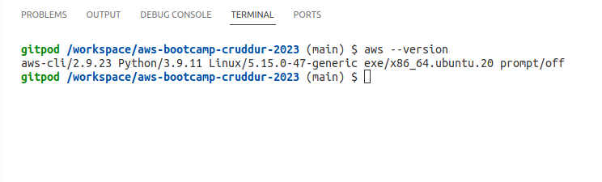
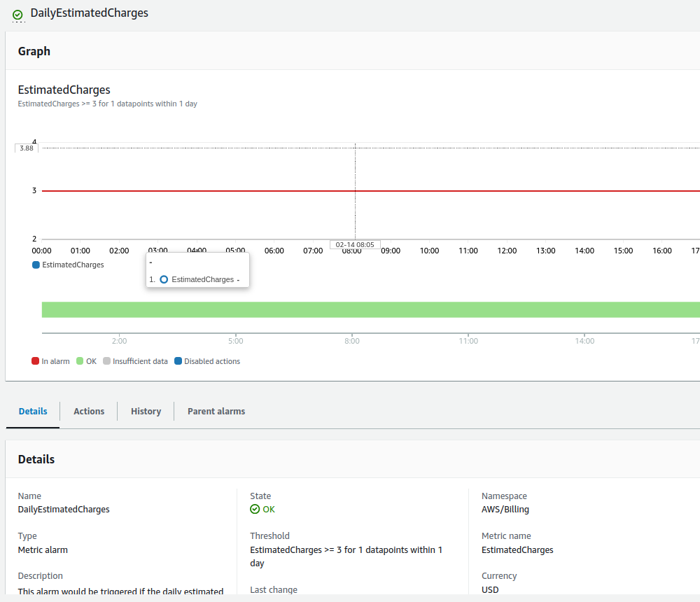
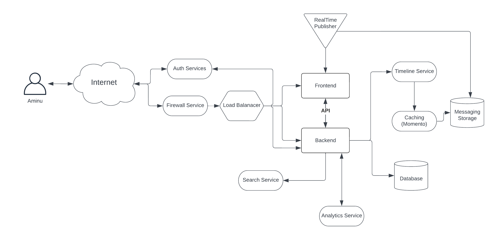
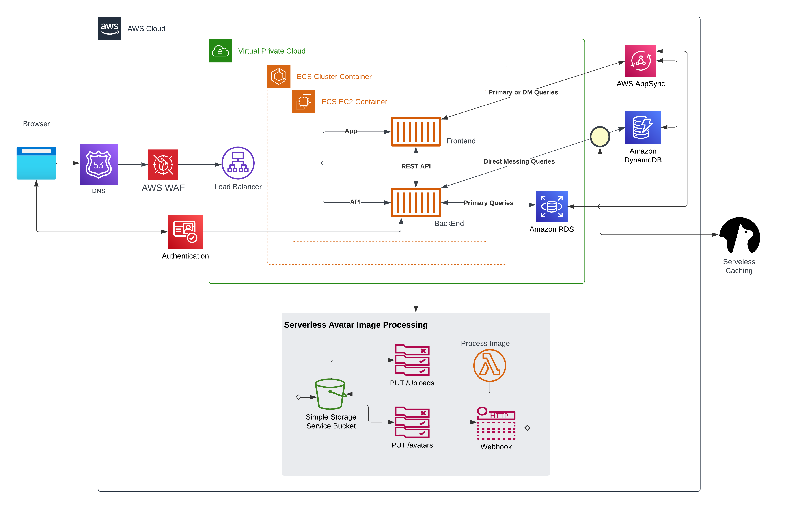

# Week 0 — Billing and Architecture

## Instructional Videos
All the instructional videos for this week watched. The Business scenario brings alot of items/stuff into perspective, thereby giving a broadoverview of what is expected. Watching Ashish's security best practices helped me reinforce what I already practice on my AWS accounts e.g. 
- Use of organizations to partition different types of usage
- Enforcing MFA for user accounts
- Using the least-priviledge approach when assigning policies to roles and users. etc.

On Chirag's spend consideration, I enabled access to billing information and also updated the rule that allows billing alerts to be delivered. Lastly, I created a budget using the AWS/Billing console. It is a monthly spend budget for 20$ and contains 2 actions that alerts me when:
- Actual cost greater than 50% i.e. 10$
- Actual cost greater than 80% i.e. 16$

    Budget:

    

    Actions:

    


## Installing AWS CLI on Gitpod
1. Firstly, I generated access token for my already existing admin  in the AWS IAM console
2. Launched a gitpod workspace and then persisted the tokens using the *gp env* command
3. I updated the [.gitpod.yml](../.gitpod.yml) file to allow installation task of AWS CLI at workspace startup.
4. I restarted my workspace and voila: CLI installed and functional, see image below:

    AWS CLI on GitPod:

    


## Billing Alarm
Billing alarm was created programatically by doing the flowing on the aws cli:
1. create a topic using
    ```bash
    aws sns create-topic --name bootcamp-alarm
    ```
2. Subscribe to topic using the arn that was returned from 1 above.
    ```bash
    aws sns subscribe \
    --topic-arn <ARN from 1. above i.e. arn::...> \
    --protocol email \
    --notification-endpoint <email-address>
    ```
3. Confirmed the email in my inbox. In my case, email was found in my spam folder.
4. Used the [alarm-config](../aws/json/alarm-config.json) to create a billing alert when I exceed a spend of 3$ daily
    ```bash
    aws cloudwatch put-metric-alarm --cli-input-json file://aws/json/alarm-config.json
    ```
    Billing Alarm:

    

## Conceptual Design
Drawing the conceptual diagram on a napkin was fun. Raised questions about security concerns (e.g DDoS), how the front end will communicate with backend, what items to cache etc.

Napkin Sketch:


Also, a better conceptual design was redrawn in Lucid chart which can be found [here](https://lucid.app/lucidchart/b668d3fa-dfee-4b6e-aaed-2acab1ac44f5/edit?invitationId=inv_33422633-9f50-4f26-9673-61152977fa7a) and also shown below:

Conceptual Design:



## Logical Architectural Diagram
The logical architectural diagram can be found [here](https://lucid.app/lucidchart/076da0af-9754-41ff-94a1-60ba0e8b2de2/edit?invitationId=inv_b3457d9b-2c4c-49cf-8621-8b10ea4ab387) and also shown below:



I added an additinal Firewall for security concerns ranging from DDOS, SQL injections etc. even though I found out from researching that one can use AWS WAF directly from within an ALB (Application Load Balancer).

