# Week 1 — App Containerization

## Required Homework
1. Containerization or both frontend and back end was completed by 
    -   Writing a dockerfile for the frontend located [here](../frontend-react-js/Dockerfile)
    - Writing a dockerfile for the backend located [here](../backend-flask/Dockerfile)
    - Writing a docker-compe file located here  [here](../docker-compose.yml)

2. Documented the notifications endpoint for the openAPI, wrote the flask backend and react front  for notifications. Afterwards ``` docker compose up ``` was run in the terminal to start the required containers. Please refer to the images below with modified notifications as proof of work

    Notifications Backend Response:

    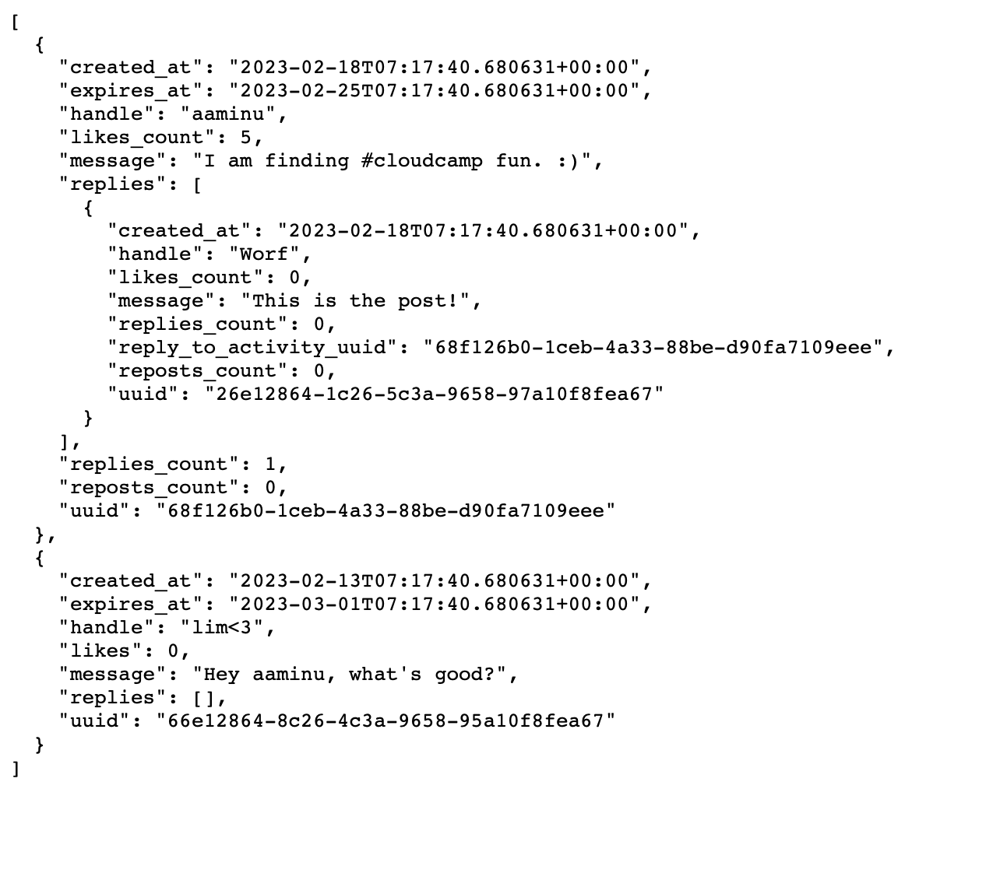

    Notifications Page:

    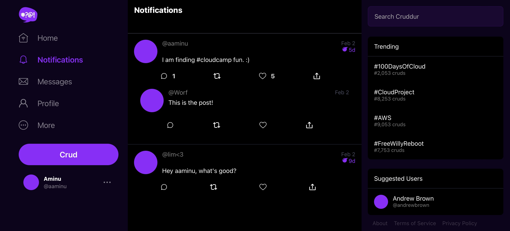

3. Updated the docker-compose file and gitpod yaml file per instruction and ran a DynamoDB local container Please see images below;

    Creating a Table in DynamoDB:

    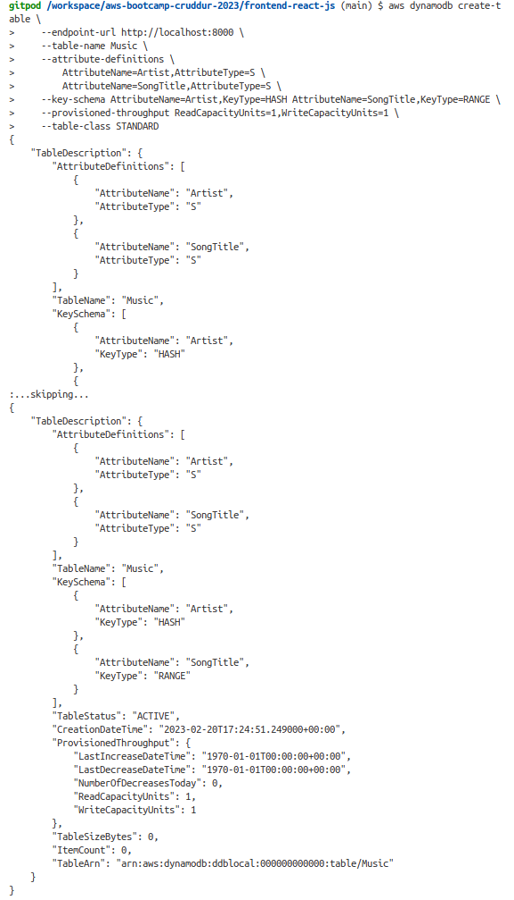

    Inserting an Item in the Table from Above:

    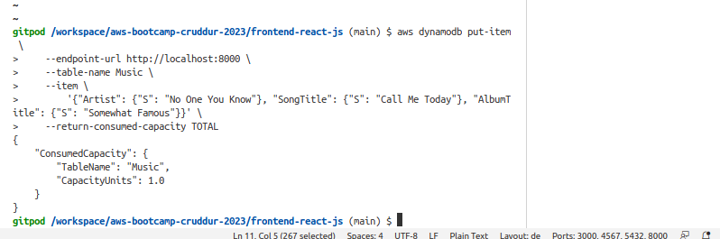

4. Also updated the gitpod yaml file along side 3. above. Please see image below as proof of workings

    Postgres DB:

    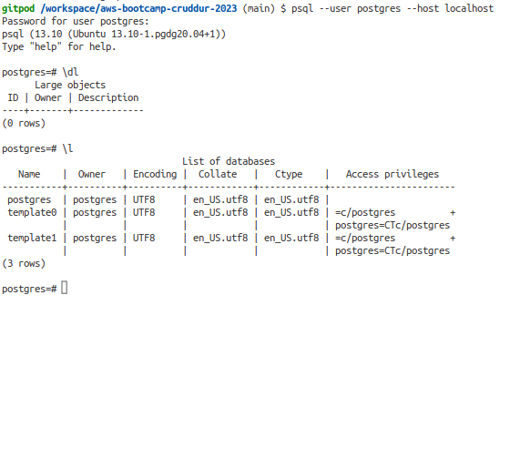

5. Added an additional task to the gitpod yaml file that installs the required node modules into the /frontend-react-js folder during start-up. Without this option, my app failed after I started a new workspace and manually forgot to install it. The addition task can be seen below:
    ```yaml
    // this belongs to the task
        - name: npm-init
            init: |
                cd /workspace/aws-bootcamp-cruddur-2023/frontend-react-js
                npm i
    ```


## Homework Challenges
1. Running the dockerfile CMD as an external script: to achieve this, the following steps were taken:
    - A copy of the backend-flask was created in [./journal/week1_homework](./week1_homework/).
    - In the [./journal/week1_homework/backend-flask](./week1_homework/backend-flask) directory a shell script name [command.sh](./week1_homework/backend-flask/command.sh) is created by doing the following on the terminal:
        ```bash
        $ touch command.sh
        $ cat <<EOF>> cmd.sh
        > #!/bin/bash
        > python3 -m flask run --host=0.0.0.0 --port=4567
        > EOF
        $
        ```
    - To confirm the content, the following command is used and the output observed
        ```bash
        $ cat command.sh
        #!/bin/bash
        python3 -m flask run --host=0.0.0.0 --port=4567
        $
        ```
    - Next, opened up the [Dockerfile](./week1_homework/backend-flask/Dockerfile) and made the necessary changes to allow use of the external script. The sections modified are commented .
        ```docker
        FROM python:3.10-slim-buster

        WORKDIR /backend-flask

        COPY requirements.txt requirements.txt
        RUN pip3 install -r requirements.txt

        COPY . .

        # change access permission to allow execution of the script
        RUN chmod +x ./command.sh

        # Add the frontend and backend url env vars here
        ENV FLASK_ENV=development FRONTEND_URL='*' BACKEND_URL='*'

        EXPOSE ${PORT}

        # use command script as starting point
        CMD ["./command.sh"]
        ```
    - While still in the directory [./journal/week1_homework/backend-flask](./week1_homework/backend-flask), the docker image is built by running the following command in the terminal:
        ```bash
        $ docker build -t  backend-flask:external .
        Step 1/9 : FROM python:3.10-slim-buster
        .....
        .....
        Step 9/9 : CMD ["./command.sh"]
        Successfully built 121a3e6ace41
        Successfully tagged backend-flask:external
        $
        ```
    - Testing out the new docker image by running
        ```bash 
        $ docker run --rm -it -p 4567:4567 backend-flask:external
        ```
        Results:

        

        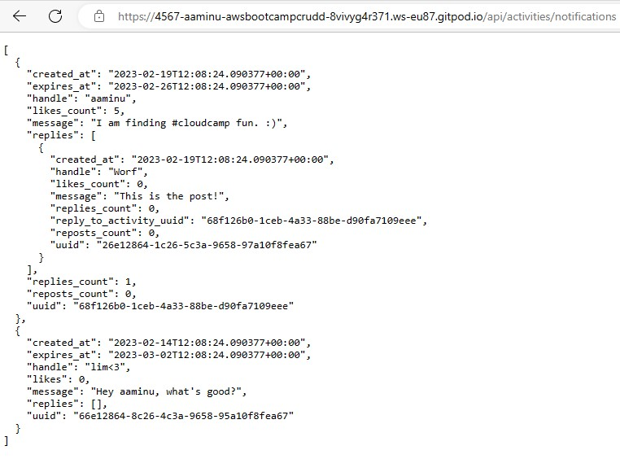

        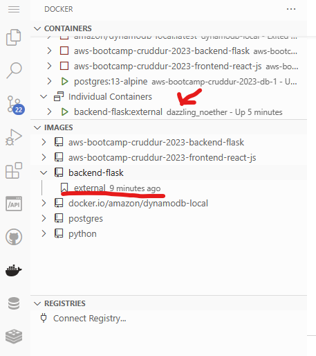

2.   Pushing and Taging an Image to Dockerhub

        -   Since I already have a docker hub, I didn't need to create a new one
        -   On the terminal, I logged into my docker hub by running:
            ```bash
            $ docker login
            ```
            I inputted my username and password, and was successfully logged in.
        - I created a repo on docker hub and named it *aaminu/backend-flask*

        -   I tagged the image built in 1. above by doing:
            ```bash
            $ docker tag backend-flask:external aaminu/backend-flask:external
            ```
        - final, I pushed the image to dockerhub by:
            ```bash
            $ docker push aaminu/backend-flask:external
            ```
        	Image in Dockerhub:

            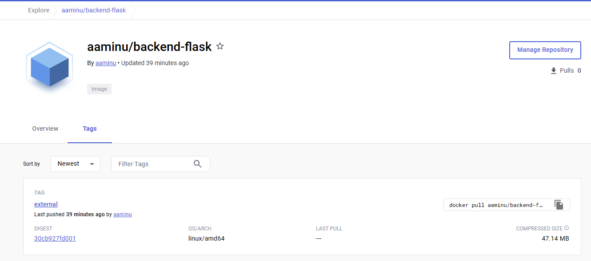

3. Healthcheck in the docker-compose file (PS: This is on the main project)
    -   implemented for both frontend and backend container by adding the following to the [docker-compose](../docker-compose.yml) file:
        ```yaml
        # backend-flask
        healthcheck:
            test: ["CMD-SHELL", "curl -f http://localhost:4567/api/activities/home || exit 1", "curl -f https://4567-${GITPOD_WORKSPACE_ID}.${GITPOD_WORKSPACE_CLUSTER_HOST}/api/activities/home || exit 1"]
            interval: 1m30s
            timeout: 30s
            retries: 5
            start_period: 30s
        
        # frontend-re
        healthcheck:
            test: ["CMD-SHELL", "curl -f http://localhost:3000/ || exit 1", "curl -f https://4567-${GITPOD_WORKSPACE_ID}.${GITPOD_WORKSPACE_CLUSTER_HOST}/ || exit 1"]
            interval: 1m30s
            timeout: 30s
            retries: 5
            start_period: 30s
        ``` 
    - To ensure that ports open to public upon launch of containers, an additional command is added to the [.gitpod.yml](../.gitpod.yml) file. This can be seen below
        ```yaml
        ports:
          - port: 3000
            name: Frontend-react-js
            visibility: public
          - port: 4567
            name: Backend-flask
            visibility: public
        ```
    - The docker compose-up command was issued and all containers were compiled and started. A simple ``` docker ps ``` showed all container were running. The two containers with healthchecks has new tags *(health: starting)* under their status. Please see below:

        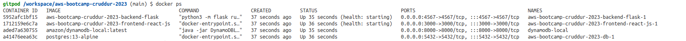
    
    - After a few minute the the backend-flask became unhealthy. To investigate, the following command was issued in the terminal:
        ```bash
        $ docker inspect --format='{{json .State.Health}}' < name of backend-flask contain>
        ```
        The *< name of backend-flask contain >* is *aws-bootcamp-cruddur-2023-backend-flask-1*.
    - Investigating the error from above revealed that certain distros like Alpine and Buster have no curl installed. To fix that problem, I updated the backendflask/ [Dockerfile](../backend-flask/Dockerfile) to install curl as part of it's tools. It was acheived by adding the following:
        ```docker
        RUN apt-get update && apt-get install -y curl
        ```
    - Using the Compose Restart and allowing the container to run for a while, both frontend and backend are healthy. These can be checked by Please see the status after 33mins of runtime below:

        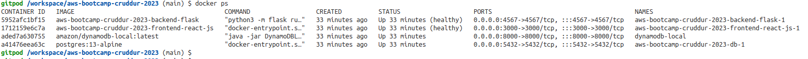


    - For logging purpose, the following command was used to capture a json format health status and piped into a json file. Please see below for sample
        ```bash
        $ docker inspect --format='{{json .State.Health}}' < name of backend-flask contain> > <file_name.json>
        #To beatify the json for reability, do
        $ python3 -m json.tool <file_name.json> <new_file_name.json>
        #remove redundant file
        $ rm <file_name.json>
        ```
    - Please take a look at the sample output log file in [formated_backend_health.json](./week1_homework/health_check/formatted_frontend_health.json)

4. Installing Docker on local machine and running same containers running outside of Gitpod
    - Followed the official instructions for installing a docker engine on ubuntu located [here](https://docs.docker.com/engine/install/ubuntu/):

        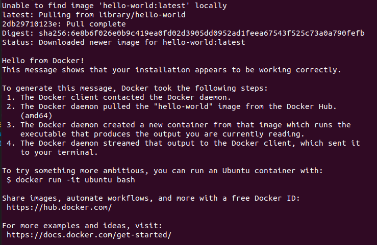
    
    - Cloned my github repo, and renamed it to local-aws-bootcamp-cruddur-2023

    - Installed the required dependency in the necessary folder by taking a look in the gitpod.yaml file.

    - Inspected the  docker-compose file, made changes to the enivromental variables since everything would be run on my local machine. Please see below for effected changes
        ```yaml
        version: "3.8"
        services:
        backend-flask:
            environment:
            FRONTEND_URL: "*" 
            BACKEND_URL: "*"
            build: ./backend-flask
            ports:
            - "4567:4567"
            volumes:
            - ./backend-flask:/backend-flask
            healthcheck:
            test: ["CMD-SHELL", "curl -f http://localhost:4567/api/activities/home || exit 1"]
            interval: 1m30s
            timeout: 30s
            retries: 5
            start_period: 30s
        frontend-react-js:
            environment:
            REACT_APP_BACKEND_URL: http://localhost:4567 #Backend url would be available via localhost exposed port 4567
            build: ./frontend-react-js
            ports:
            - "3000:3000"
            volumes:
            - ./frontend-react-js:/frontend-react-js
            healthcheck:
            test: ["CMD-SHELL", "curl -f http://localhost:3000/ || exit 1"]
            interval: 1m30s
            timeout: 30s
            retries: 5
            start_period: 
        ```

    - After the required modification, running the Compose Up command started the build process. Please see image below for running application
        Local compose:

        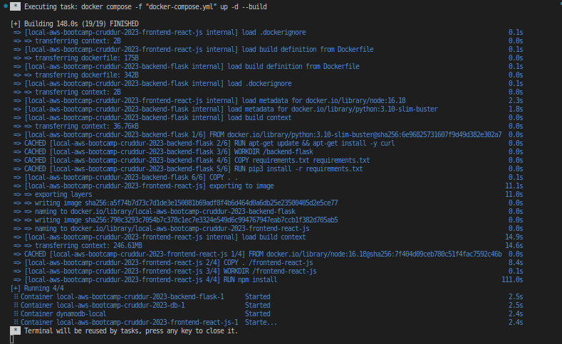

        Landing Page:

        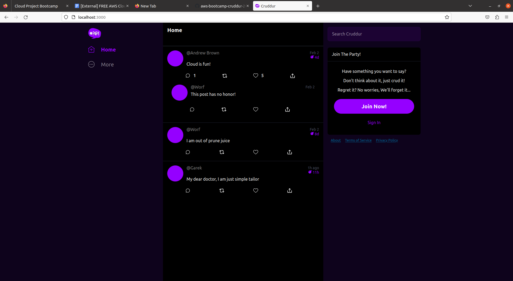

        Health Status:

        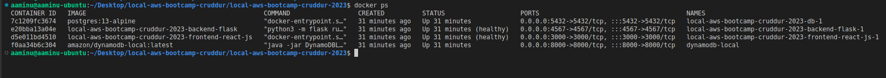

5. Launching an AWS EC2 instance, installing docker and running a docker image:

    - Logged into an aws console with a non-root account with required permission
    - From the console, navigated to EC2 service page. Once on the page, I tried lauching an instance.
    - On the pop up from above, I inputted all the correct/required details which included:
        - Name of instance
        -correct image to use (AMI Linux 2)
        - Enabled SSH for my IP address
        -Created a key pair for accessing my instance via SSH and downloaded it onto my computer
        - In the advance tab, I used a copied a custom script into the user data field. The script install docker during the startup phase of the instance. Content of the [script](./week1_homework/AWS_EC2/bash_script.txt) is shown below:
            ```txt
            #!/bin/bash
            sudo yum update -y
            sudo amazon-linux-extras install docker
            sudo service docker start
            sudo systemctl enable docker
            sudo usermod -a -G docker ec2-
            ```
        - Finally launched the instance and waited till the status changed from initializing.
    - On my computer, I navigated to the location of my key pair from the terminal, and issued:
        ``` bash 
        $ sudo ssh -i < keyname > ec2-user@< instance_public_address > 
        ```
        This connected me to my ec2 instance. Please see image below:

        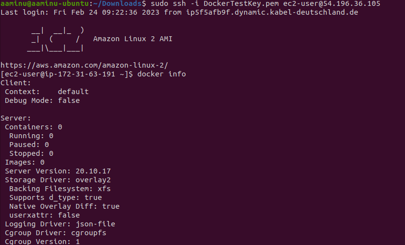

        The above image also shows docker has been installed after the command *docker info* was issued.
    
    - To futher test docker, the ``` docker run hello-world ``` was issued and the result displayed below:

        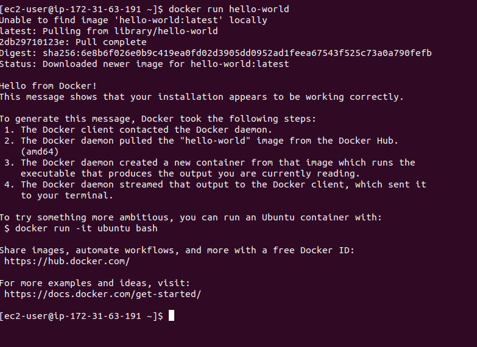     

    - It was time to finally test pulling the image I publish to Dockerhub and running the said image. Please see image below;

        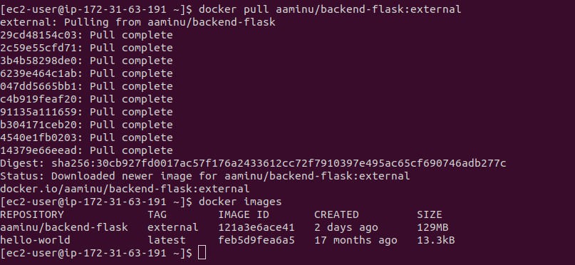

    - Finally running the image and checking if I could get an ouput yielded the successful image shown below:
        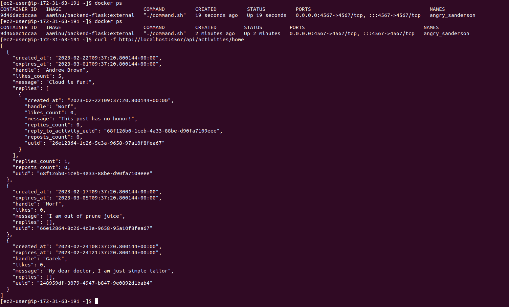

6. MULTISTAGE BUILD IN DOCKER FILE
    - To test this approach, I decided to build a container that helps me setup a development enviroment for raspberry-pi pico/RP2040 chips. 

    - Created folder in [journal/week1_homework](./week1_homework/) called [multistage_build](./week1_homework/multistage_build/)
    
    - Next, created a docker file
        ```docker
        FROM debian:10-slim AS basecontainer
        RUN apt-get update && apt-get upgrade --yes && apt-get install sudo apt-utils python3 --yes


        FROM basecontainer AS buildtool
        RUN sudo apt-get update && sudo apt-get install git build-essential cmake --yes
        RUN sudo apt-get install gcc-arm-none-eabi \
                                libnewlib-arm-none-eabi \
                                libstdc++-arm-none-eabi-newlib --yes


        FROM buildtool AS sdkgetter
        RUN adduser pico_user
        USER pico_user
        WORKDIR /home/pico_user
        RUN git clone https://github.com/raspberrypi/pico-sdk.git --branch master && cd pico-sdk && git submodule update --init


        FROM sdkgetter
        ENV PICO_SDK_PATH="/home/pico_user/pico-sdk"
        EXPOSE 5000
        ```
    - While in the folder described above, ran ```docker build --pull --rm -f "./Dockerfile" -t pico-container . ```
    
    - This took a while. After it was done running, I attached a shell to inspect everything

    - Next I created a [docker-compose.yaml](./week1_homework/multistage_build/docker-compose.yml) with content:
        ``` yaml
        version: "3.8"
        services:
        pico:
            container_name: pico-dev-container
            build: .
            stdin_open: true # docker run -i
            tty: true        # docker run -t
            ports:
            - "5000:5000"
            
            # Remember to change the volume directory to your project directory. The default directory on the container is /home/pico_user/
            volumes:
            - ./hello_world:/home/pico_user/hello_world
        ```

        Using Compose Up:

        

    - Commented the important part in the compose file especially the volume mounting, In the compose file, I used a sample hello world project.

    - After making sure everything was set, I ran the compose up command

        

    - Since my intension was to develop in this container, I installed [Remote Development Extension Pack](https://marketplace.visualstudio.com/items?itemName=ms-vscode-remote.vscode-remote-extensionpack) in VS Code.

    - Followed the instructions to get it connected to my docker container. 

    - Built the project and it was sucessful. Kindly see images 
    
    Preprocessing Project:

    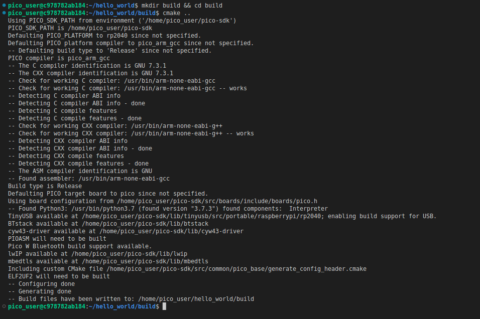

    Building, Linking and Locating the Binaries:
    
    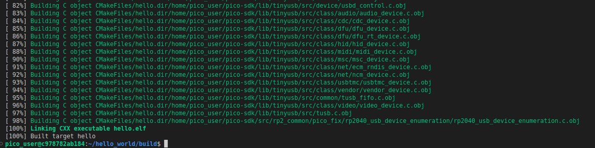
