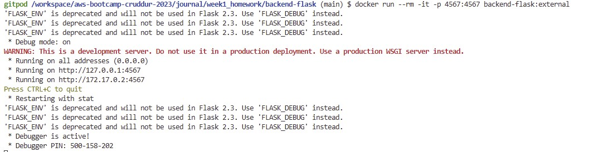

# Week 1 — App Containerization

## Required Homework
1. Containerization or both frontend and back end was completed by 
    -   Writing a dockerfile for the frontend located [here](../frontend-react-js/Dockerfile)
    - Writing a dockerfile for the backend located [here](../backend-flask/Dockerfile)
    - Writing a docker-compe file located here  [here](../docker-compose.yml)

2. Documented the notifications endpoint for the openAPI, wrote the flask backend and react front  for notifications. Afterwards ``` docker compose up ``` was run in the terminal to start the required containers. Please refer to the images below with modified notifications as proof of work

    Notifications Backend Response:

    

    Notifications Page:

    

3. Updated the docker-compose file and gitpod yaml file per instruction and ran a DynamoDB local container Please see images below;

    Creating a Table in DynamoDB:

    

    Inserting an Item in the Table from Above:

    

4. Also updated the gitpod yaml file along side 3. above. Please see image below as proof of workings

    Postgres DB:

    

5. Added an additional task to the gitpod yaml file that installs the required node modules into the /frontend-react-js folder during start-up. Without this option, my app failed after I started a new workspace and manually forgot to install it. The addition task can be seen below:
    ```yaml
    // this belongs to the task
        - name: npm-init
            init: |
                cd /workspace/aws-bootcamp-cruddur-2023/frontend-react-js
                npm i
    ```


## Homework Challenges
1. Running the dockerfile CMD as an external script: to achieve this, the following steps were taken:
    - A copy of the backend-flask was created in [./journal/week1_homework](./week1_homework/).
    - In the [./journal/week1_homework/backend-flask](./week1_homework/backend-flask) directory a shell script name [command.sh](./week1_homework/backend-flask/command.sh) is created by doing the following on the terminal:
        ```bash
        $ touch command.sh
        $ cat <<EOF>> cmd.sh
        > #!/bin/bash
        > python3 -m flask run --host=0.0.0.0 --port=4567
        > EOF
        $
        ```
    - To confirm the content, the following command is used and the output observed
        ```bash
        $ cat command.sh
        #!/bin/bash
        python3 -m flask run --host=0.0.0.0 --port=4567
        $
        ```
    - Next, opened up the [Dockerfile](./week1_homework/backend-flask/Dockerfile) and made the necessary changes to allow use of the external script. The sections modified are commented .
        ```docker
        FROM python:3.10-slim-buster

        WORKDIR /backend-flask

        COPY requirements.txt requirements.txt
        RUN pip3 install -r requirements.txt

        COPY . .

        # change access permission to allow execution of the script
        RUN chmod +x ./command.sh

        # Add the frontend and backend url env vars here
        ENV FLASK_ENV=development FRONTEND_URL='*' BACKEND_URL='*'

        EXPOSE ${PORT}

        # use command script as starting point
        CMD ["./command.sh"]
        ```
    - While still in the directory [./journal/week1_homework/backend-flask](./week1_homework/backend-flask), the docker image is built by running the following command in the terminal:
        ```bash
        $ docker build -t  backend-flask:external .
        Step 1/9 : FROM python:3.10-slim-buster
        .....
        .....
        Step 9/9 : CMD ["./command.sh"]
        Successfully built 121a3e6ace41
        Successfully tagged backend-flask:external
        $
        ```
    - Testing out the new docker image by running
        ```bash 
        $ docker run --rm -it -p 4567:4567 backend-flask:external
        ```
        Results:

        

        

        

2.   Pushing and Taging an Image to Dockerhub

        -   Since I already have a docker hub, I didn't need to create a new one
        -   On the terminal, I logged into my docker hub by running:
            ```bash
            $ docker login
            ```
            I inputted my username and password, and was successfully logged in.
        - I created a repo on docker hub and named it *aaminu/backend-flask*

        -   I tagged the image built in 1. above by doing:
            ```bash
            $ docker tag backend-flask:external aaminu/backend-flask:external
            ```
        - final, I pushed the image to dockerhub by:
            ```bash
            $ docker push aaminu/backend-flask:external
            ```
        	Image in Dockerhub:

            
