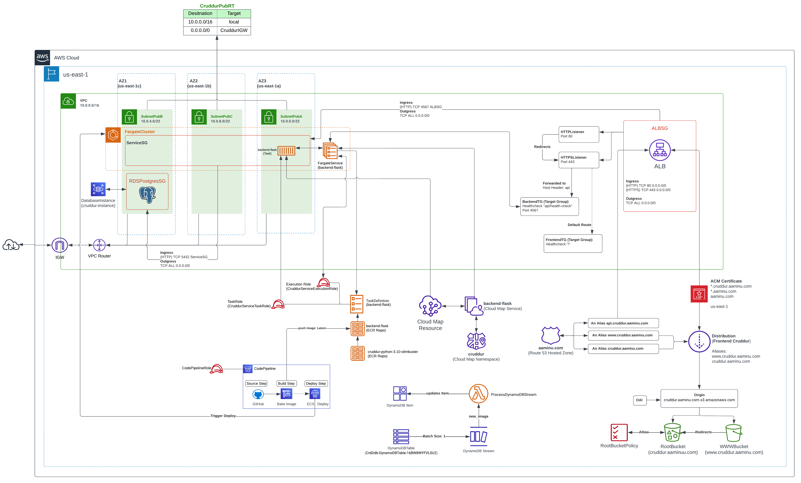
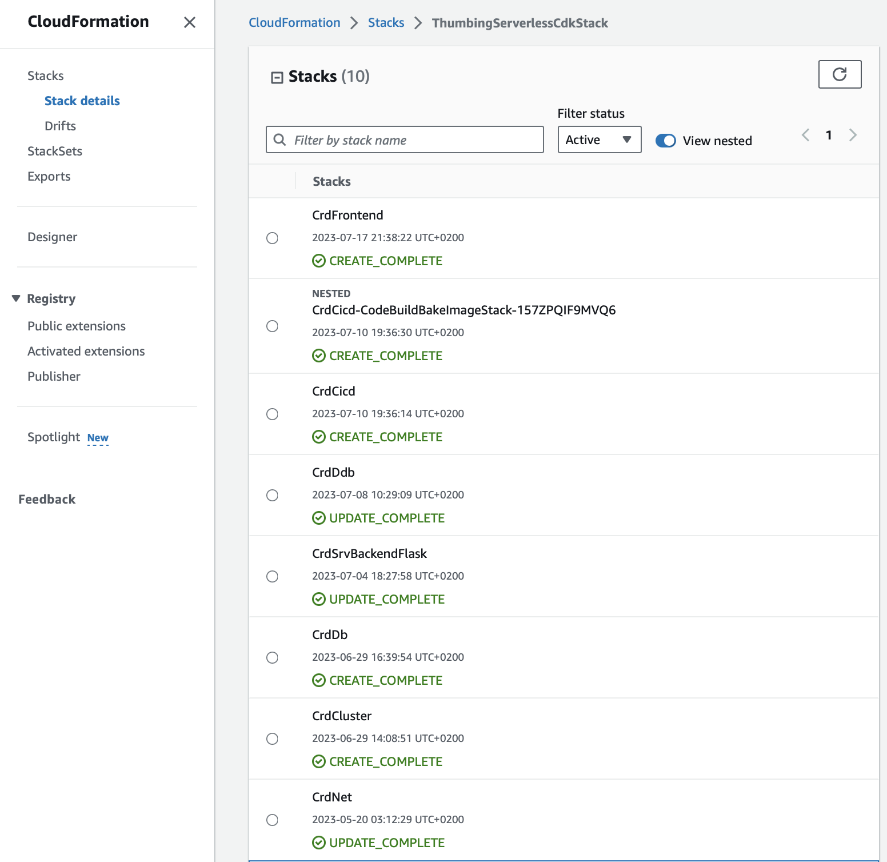

# Week 10 — CloudFormation

The composition of the resourses deployed using cloud formation is depicted in the image below:



The preceding chapters details the individual stacks that make up the deployed cloudformation stacks.
## Network Stack
The network stack cloudformation template is named as [aws/cfn/networking/template.yaml](../aws/cfn/networking/template.yaml). It contains the following resource to be deployed by cloudformation:
- VPC
- Internet Gateway
- Two route tables
    - One with external target to Internet gateway and local target (Public)
    - One with only local target (Private)
- 6 Subnets Explicitly attached to the route tables
    - 3 Public Subnets numbered A - C and associated to the public route table
    - 3 Private Subnets numbered A - C and associated to the private route table

The staging script for the execution/provisioning of the network stack change-set on cloudformation is located in [bin/cfn](../bin/cfn/) directory as [network-staging](../bin/cfn/network-staging). However, before running the script, certain software packages are required for parsing the config file to the yaml template. This is done on the command-line:

```bash
gem install cfn-toml
pip install cfn-lint
cargo install cfn-guard
```
Also added an install task to [gitpod.yml](../.gitpod.yml)

```yaml
  - name: cfn
    before: |
      pip install cfn-lint
      cargo install cfn-guard
      gem install cfn-toml
```

## ECS Cluster Stack
The ECS cluster stack template and config file are located in the [aws/cfn/cluster](../aws/cfn/cluster/) directory and  contains the following resources:
 - ECS Fargate Cluster
  - Application Load Balancer (ALB)
    - ipv4 only
    - internet facing
    - certificate attached from Amazon Certification Manager (ACM)
  - ALB Security Group
  - Service Security Group
  - HTTPS Listener
    - send naked domain to frontend Target Group
    - send api. subdomain to backend Target Group
  - HTTP Listener
    - redirects to HTTPS Listener
  - Backend Target Group
  - Frontend Target Group

To avoid additional charges, I deleted the following resources:
- Former ECS Backend and Frontend Service
- Former ECS Cluster
- Former  Frontend and Backend target groups
- Former ALB
- cruddur namespace on aws cloudmap

The staging script for the execution/provisioning of the network stack change-set on cloudformation is located in [bin/cfn/](../bin/cfn/) directory as [cluster-staging](../bin/cfn/cluster-staging).

## RDS Postgres Stack
The RDS stack template and config file are located in the [aws/cfn/db](../aws/cfn/db/) directory and  contains the following resources:
  - RDS Instance
  - DB Security Group
  - DBSubnetGroup

The staging script for the execution/provisioning of the RDS stack change-set on cloudformation is located in [bin/cfn/](../bin/cfn/) directory as [db-staging](../bin/cfn/db-staging).

## ECS Service (Backend-Flask) 
The ECS Service stack template and config file are located in the [aws/cfn/service](../aws/cfn/service/) directory and  contains the following resources:
  - Task Role
  - Execution Role
  - Task Definition
  - Fargate Service
The staging script for the execution/provisioning of the Service stack change-set on cloudformation is located in [bin/cfn/](../bin/cfn/) directory as [service-staging](../bin/cfn/service-staging).

## DynamoDB Stack
The DynamoDB stack template and config file are located in the [/ddb](../ddb/) directory and  contains the following resources:
  - DynamoDB Table
  - DynamoDB Stream
  - Log
  - Execution Role

In order to use AWS SAM for the dynamodb streams, I installed the aws-sam package and also added it to the [gitpod.yml](../.gitpod.yml) file.
```yaml
 - name: aws-sam
    init: |
      cd /workspace
      wget https://github.com/aws/aws-sam-cli/releases/latest/download/aws-sam-cli-linux-x86_64.zip
      unzip aws-sam-cli-linux-x86_64.zip -d sam-installation
      sudo ./sam-installation/install
      cd $THEIA_WORKSPACE_ROOT
```
The required script for the execution/provisioning of the DDB stack change-set on cloudformation is located in [ddb/](../ddb/) directory as [deploy](../ddb/deploy). Finally, I added the the following lines to my .gitignore files.
```txt
build.toml
.aws-sam
tmp/*
```

## CICD Stack
The CICD stack template and config file are located in the [aws/cfn/service](../aws/cfn/cicd/) directory and contains the following resources:
- CodeStar Connection V2 Github
- CodePipeline
- CodePipelineRole
- Codebuild
  - Codebuild Project
  - Codebuild Project Role

Before using the staging script located in [bin/cfn/](../bin/cfn/) directory as [db-staging](../bin/cfn/cluster-staging) for the execution/provisioning of the CICD stack change-set on cloudformation, I created an S3 bucket called `codepipeline-cruddur-artifacts-aaminu`. This name was also supplied in the [config.toml](../aws/cfn/cicd/config.toml) file.

## Frontend Cloudfront Distribution Network Stack
The frontend stack makes use of cloudfront distribution. Thee template is located in the [aws/cfn/frontend](../aws/cfn/frontend/) directory and  contains the following resources:
  - CloudFront Distribution
  - S3 Bucket for www.
  - S3 Bucket for naked domain
  - Bucket Policy
The required script for the execution/provisioning of the CDN stack change-set on cloudformation is located in [bin/cfn/](../bin/cfn/) directory as [frontend-staging](../bin/cfn/frontend-staging).


All stacks were depolyed sucessfully as shown in the image below:
