# Week 2 — Distributed Tracing
## **Required Homework**

### **Distrbuted Tracing with Honeycomb**
1. Created a trial account at [honeycomb.io](https://ui.honeycomb.io/)
2. Created a new enviroment and attained the api key
3. Persisted the Api key to my gitpod enviroment by doing
    ```bash
    $ gp env HONEYCOMB_API_KEY="<API Key>"
    HONEYCOMB_API_KEY="<API Key>"
    ```
4. To ensure my key is propagated across all shells, the workspace was closed and a new one opened.
5. To ensure all dependencies(Open telemetry "OTEL") are met, thee following was added to the [requirements.txt](../backend-flask/requirements.txt) file:
    ```txt
    opentelemetry-api 
    opentelemetry-sdk 
    opentelemetry-exporter-otlp-proto-http 
    opentelemetry-instrumentation-flask 
    opentelemetry-instrumentation-requests
    ```
6. The [docker-compose.yml](../docker-compose.yml) file was also updated to reflect neccessary enivorment keys:
    ````yaml
    version: "3.8"
    services:
        backend-flask:
            environment:
                ...
                ...
                OTEL_SERVICE_NAME: "backend-flask"
                OTEL_EXPORTER_OTLP_ENDPOINT: "https://api.honeycomb.io"
                OTEL_EXPORTER_OTLP_HEADERS: "x-honeycomb-team=${HONEYCOMB_API_KEY}"
        ...
    ```
7. Next, to start getting traces in honeycomb, I added the following to the [app.py](../backend-flask/app.py):
    ```python
    ...
    ...

    # Honeycomb
    from opentelemetry import trace
    from opentelemetry.instrumentation.flask import FlaskInstrumentor
    from opentelemetry.instrumentation.requests import RequestsInstrumentor
    from opentelemetry.exporter.otlp.proto.http.trace_exporter import OTLPSpanExporter
    from opentelemetry.sdk.trace import TracerProvider
    from opentelemetry.sdk.trace.export import BatchSpanProcessor

    # Initialize tracing and an exporter that can send data to Honeycomb
    provider = TracerProvider()
    processor = BatchSpanProcessor(OTLPSpanExporter())
    provider.add_span_processor(processor)
    trace.set_tracer_provider(provider)
    tracer = trace.get_tracer(__name__)


    app = Flask(__name__)

    # Initialize automatic instrumentation with Flask
    FlaskInstrumentor().instrument_app(app)
    RequestsInstrumentor().instrument()
    ```
8. Finally, it was time to run ```docker compose up``` and see if traces are recieved in honeycomb.
9. Below is a proof of trace in honeycomb platform.
    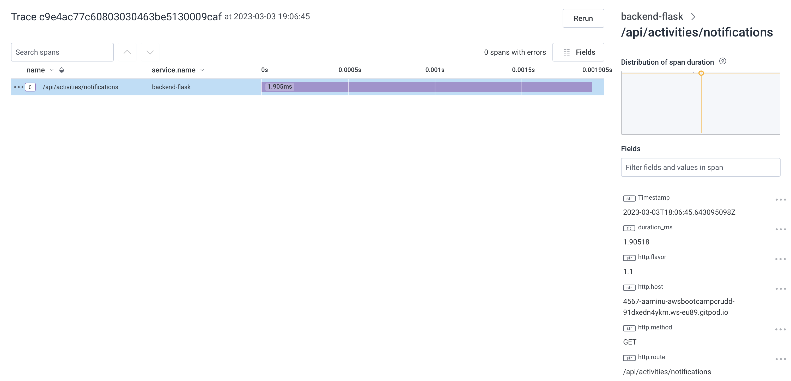


### **Distrbuted Tracing with AWS Xray**
1. To get started with aws-xray, the following was added to the [requirements.txt](../backend-flask/requirements.txt) file to ensure the necessary sdk was dowmnloaded:
    ```txt
    aws-xray-sdk
    ```
2. In the [docker-compose.yml](../docker-compose.yml) file, the following was added:
    ```yaml
    version: "3.8"
    services:
        backend-flask:
            environment:
                ...
                AWS_XRAY_URL: "*4567-${GITPOD_WORKSPACE_ID}.${GITPOD_WORKSPACE_CLUSTER_HOST}*"
                AWS_XRAY_DAEMON_ADDRESS: "xray-daemon:2000"
              
        ...
        xray-daemon:
            image: "amazon/aws-xray-daemon"
            environment:
                AWS_ACCESS_KEY_ID: "${AWS_ACCESS_KEY_ID}"
                AWS_SECRET_ACCESS_KEY: "${AWS_SECRET_ACCESS_KEY}"
                AWS_REGION: "us-east-1"
            command:
                - "xray -o -b xray-daemon:2000"
            ports:
                - 2000:2000/udp
    ```
3. The above sets the required enviroment variables and also defines the conntainer for the xray-daemon.
4. Next was to create a group on aws-xray to ensure we could group our traces. The following command as issued in the terminal since aws cli is already installed:
    ```bash
    $ aws xray create-group \
    --group-name "Cruddur" \
    --filter-expression "service(\"backend-flask\")"
    ```
5. The above should return a response with the arn and other parameters to indicate success
6. To create a samplinng rule for xray-services, a file was created in [aws-bootcamp-cruddur-2023/aws/json](../aws/json/) called [xray.json](../aws/json/xray.json) with content:
    ```json
    {
    "SamplingRule": {
        "RuleName": "Cruddur",
        "ResourceARN": "*",
        "Priority": 9000,
        "FixedRate": 0.1,
        "ReservoirSize": 5,
        "ServiceName": "backend-flask",
        "ServiceType": "*",
        "Host": "*",
        "HTTPMethod": "*",
        "URLPath": "*",
        "Version": 1
        }
    }
    ```
7. In the terminal, the following command was issued: 
    ```bash
    $ aws xray create-sampling-rule --cli-input-json file://aws/json/xray.json
    ```
8. In the [app.py](../backend-flask/app.py), the following was added:
    ```python
    ...
    ...

    # X_RAY
    from aws_xray_sdk.core import xray_recorder
    from aws_xray_sdk.ext.flask.middleware import XRayMiddleware

    xray_url = os.getenv("AWS_XRAY_URL")
    #xray_recorder.configure(service='backend-flask', dynamic_naming=xray_url)
    xray_recorder.configure(service='backend-flask') # To ensure all traces can be grouped under the Cruudr group created
    
    ......
    ......

    app = Flask(__name__)

    #XRAY
    XRayMiddleware(app, xray_recorder)
    ```
9. A slight change from what was provided in andrew's instruction was implemented above, these allowed me to be able to group all the traces undeet the Cruudr groupname
10. Started my containers and inspected aws xray in the aws console, please seee evidence of traces in xray:
    
    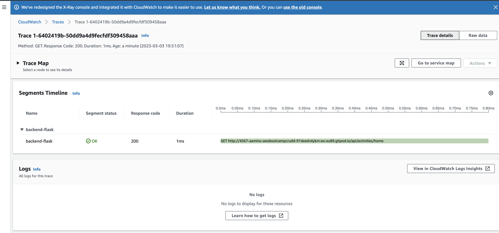

    Raw Output of the image above:
    ```json
    {
        "Id": "1-6402419b-50dd9a4d9fecfdf309458aaa",
        "Duration": 0.001,
        "LimitExceeded": false,
        "Segments": [
            {
                "Id": "eb5ca210c8961d0e",
                "Document": {
                    "id": "eb5ca210c8961d0e",
                    "name": "backend-flask",
                    "start_time": 1677869467.2860286,
                    "trace_id": "1-6402419b-50dd9a4d9fecfdf309458aaa",
                    "end_time": 1677869467.2867994,
                    "in_progress": false,
                    "http": {
                        "request": {
                            "url": "http://4567-aaminu-awsbootcampcrudd-91dxedn4ykm.ws-eu89.gitpod.io/api/activities/home",
                            "method": "GET",
                            "user_agent": "curl/7.64.0",
                            "client_ip": "34.79.69.113",
                            "x_forwarded_for": true
                        },
                        "response": {
                            "status": 200,
                            "content_length": 1235
                        }
                    },
                    "aws": {
                        "xray": {
                            "sampling_rule_name": "Cruddur",
                            "sdk_version": "2.11.0",
                            "sdk": "X-Ray for Python"
                        }
                    },
                    "service": {
                        "runtime": "CPython",
                        "runtime_version": "3.10.10"
                    }
                }
            }
        ]
    }
    ```

### **Logging with AWS CloudWatch**
1. As usual, added the required library/SDK to the [requirements.txt](../backend-flask/requirements.txt):
    ```txt
    watchtower
    ```
2. In the [docker-compose.yml](../docker-compose.yml) file, the following was added:
    ```yaml
    version: "3.8"
    services:
        backend-flask:
            environment:
                ...
                AWS_DEFAULT_REGION: "${AWS_DEFAULT_REGION}"
                AWS_ACCESS_KEY_ID: "${AWS_ACCESS_KEY_ID}"
                AWS_SECRET_ACCESS_KEY: "${AWS_SECRET_ACCESS_KEY}"
              
        ...
    ```
3. In [app.py](../backend-flask/app.py), the following was added:
    ```python
    ...
    #Cloudwatch Logs
    import watchtower
    import logging
    from time import strftime

    ...
    
    # Configuring Logger to Use CloudWatch
    LOGGER = logging.getLogger(__name__)
    LOGGER.setLevel(logging.DEBUG)
    console_handler = logging.StreamHandler()
    cw_handler = watchtower.CloudWatchLogHandler(log_group='cruddur')
    LOGGER.addHandler(console_handler)
    LOGGER.addHandler(cw_handler)
    LOGGER.info("Test Message")

    app = Flask(__name__)

    ...

    @app.after_request
    def after_request(response):
        timestamp = strftime('[%Y-%b-%d %H:%M]')
        LOGGER.error('%s %s %s %s %s %s', timestamp, request.remote_addr, request.method, request.scheme, request.full_path, response.status)
        return response
    ```
4. The compose up commannd, after a while of the container running and refreshing the pages, logs appeared on cloudwatch logs. Please see below
    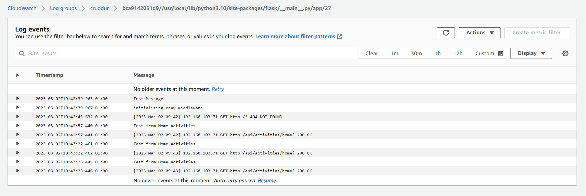


### **Logging with Rollbar**
1. Started by creating an account onnn [rollbar](https://rollbar.com), selected the right framework that for and copied the required api-key.

2. Persisted the key in the gitpod enivorment with name *ROLLBAR_ACCESS_TOKEN*. I reopened a new workspace to ensure the all enviroment keys are present

3. In the [requirements.txt](../backend-flask/requirements.txt), the following was added:
    ```txt
    blinker
    rollbar
    ```
4. In the [docker-compose.yml](../docker-compose.yml) file, the following was added:

    ```yaml
    version: "3.8"
    services:
    backend-flask:
        environment:
        ...

        ROLLBAR_ACCESS_TOKEN: "${ROLLBAR_ACCESS_TOKEN}"        
        ...
    ```
5. In [app.py](../backend-flask/app.py), the following was also added:
    ```python
    ...
    #Rollbar
    import rollbar
    import rollbar.contrib.flask
    from flask import got_request_exception

    ...

    app = Flask(__name__)

    ...

    # Rollbar Intialize
    rollbar_access_token = os.getenv('ROLLBAR_ACCESS_TOKEN')
    @app.before_first_request
    def init_rollbar():
        """init rollbar module"""
        rollbar.init(
            # access token
            rollbar_access_token,
            # environment name
            'production',
            # server root directory, makes tracebacks prettier
            root=os.path.dirname(os.path.realpath(__file__)),
            # flask already sets up logging
            allow_logging_basic_config=False)

        # send exceptions from `app` to rollbar, using flask's signal system.
        got_request_exception.connect(rollbar.contrib.flask.report_exception, app)

    @app.route('/rollbar/test')
    def rollbar_test():
        rollbar.report_message('Hello World!', 'warning')
        return "Hello World!"
    ```
6. Compose up and running the endpoint at /rollbar/test, the following log was seen on rollbar:
    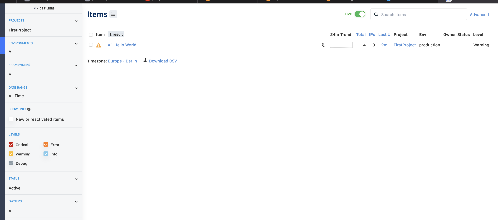


## **Homework Challenges** 

### **Instrumenting frontend-application to observe network latency between frontend and backend**
1. Researching on how to achieve the task, I realized that an addictional container has to be initialized to act as the collector and forwarder to honeycomb. Please see the approach below:

    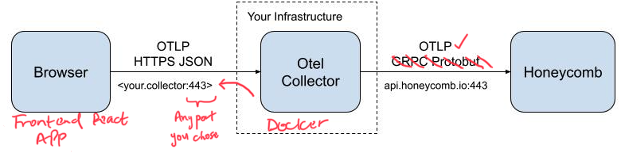

2. To achieve this task, I chose to measure the duration it takes the app to retrieving data for the homepage from the API. The steps listed below is to enable others to follow along since I had to do a lot of debugging during the initial phase. 

3. Started by making modifications to the [.gitpod.yml](../.gitpod.yml) file. The task *npm-init* was modified to include the required node modules, this is shown below
```yaml
tasks:
    # Other Task....
    - name: npm-init
        init: |
        cd /workspace/aws-bootcamp-cruddur-2023/frontend-react-js
        npm i --save \
            @opentelemetry/api \
            @opentelemetry/sdk-trace-web \
            @opentelemetry/exporter-trace-otlp-http \
            @opentelemetry/instrumentation-document-load \
            @opentelemetry/context-zone

ports:
    # other ports...
    - port: 4318
        name: otel-collector
        visibility: public
```

4. Next was to update the [docker-compose](../docker-compose.yml) file with the container required for the opentelemetry collector and also enviroment keys for the frontend application:
```yaml
version: "3.8"
services:
  # Other services
  frontend-react-js:
    environment:
      REACT_APP_BACKEND_URL: "https://4567-${GITPOD_WORKSPACE_ID}.${GITPOD_WORKSPACE_CLUSTER_HOST}"
      REACT_APP_OLTP_URL: "https://4318-${GITPOD_WORKSPACE_ID}.${GITPOD_WORKSPACE_CLUSTER_HOST}" # Opentelemetry collector service address
    build: ./frontend-react-js
    ports:
      - "3000:3000"
    volumes:
      - ./frontend-react-js:/frontend-react-js
  #opentelemetry container
  otel-collector:
    image: "otel/opentelemetry-collector"
    environment:
      HONEYCOMB_API_KEY: "${HONEYCOMB_API_KEY}" # Same honeycomb api key used in the backend enviroment
    command: [--config=/etc/otel-collector-config.yaml]
    volumes:
      - ./otel-collector-config.yaml:/etc/otel-collector-config.yaml
    ports:
      - 14268:14268
      - 4318:4318
```
5. Created the config file indicated as the volume to be mounted for the *otel-collector* service from above. This file location is the same as the docker-compose file location. The content of the file is: 
```yaml
receivers:
  otlp:
    protocols:
      http:
        cors:
          allowed_origins: #Only way I got the CORS error to dissappear
            - https://*
            - http://*

processors:
  batch:

exporters:
  otlp:
    endpoint: "api.honeycomb.io:443"
    headers:
      "x-honeycomb-team": "${HONEYCOMB_API_KEY}"

service:
  pipelines:
    traces:
      receivers: [otlp]
      processors: [batch]
      exporters: [otlp]
```
6. In the [/frontend/src/](../frontend-react-js/src/) directory, I created a [tracing.js](../frontend-react-js/src/tracing.js) file to allow for initialization of the components, the contents of the file is shown below:
```js
import { OTLPTraceExporter } from '@opentelemetry/exporter-trace-otlp-http';
import { WebTracerProvider, BatchSpanProcessor } from '@opentelemetry/sdk-trace-web';
import { ZoneContextManager } from '@opentelemetry/context-zone';
import { Resource }  from '@opentelemetry/resources';
import { SemanticResourceAttributes } from '@opentelemetry/semantic-conventions';

const exporter = new OTLPTraceExporter({
  url: `${process.env.REACT_APP_OLTP_URL}/v1/traces`,
  headers: {
    'Content-Type': 'application/json',
  },
  
});
const provider = new WebTracerProvider({
  resource: new Resource({
    [SemanticResourceAttributes.SERVICE_NAME]: 'frontend-react-js',
  }),
});
provider.addSpanProcessor(new BatchSpanProcessor(exporter));
provider.register({
  contextManager: new ZoneContextManager()
});
```
7. I then imported this file into the entry point of react app which is [index.js](../frontend-react-js/src/index.js):
```js
// this import is the first line in the file
import './tracing.js'
```
8. Next step was to create the custom span fro measuring latency in the home page. For this, the following was added to the [HomeFeedPage.js](../frontend-react-js/src/pages/HomeFeedPage.js) (Please see the comments to see what was added):
```js
//Initial imports...


//Honeycomb Tracing
import { trace, context, } from '@opentelemetry/api';
const tracer = trace.getTracer();

export default function HomeFeedPage() {
  const [activities, setActivities] = React.useState([]);
  const [popped, setPopped] = React.useState(false);
  const [poppedReply, setPoppedReply] = React.useState(false);
  const [replyActivity, setReplyActivity] = React.useState({});
  const [user, setUser] = React.useState(null);
  const dataFetchedRef = React.useRef(false);

  const loadData = async () => {
    try {
      const backend_url = `${process.env.REACT_APP_BACKEND_URL}/api/activities/home`
      var startTime = performance.now() //capture start time
      const res = await fetch(backend_url, {
        method: "GET"
      });
      var endTime = performance.now() //capture when result was returned

      let resJson = await res.json();
      if (res.status === 200) {
        setActivities(resJson)
        //Start custom span
        tracer.startActiveSpan('HomeFeedPageLoadSpan', hmfSpan => {
          // Add attributes to custom span
          hmfSpan.setAttribute('homeeFeedPage.latency_MS', (endTime - startTime)); //Latency in milliseconds
          hmfSpan.setAttribute('homeeFeedPage.status', true); //status of the item retrieved
          hmfSpan.end();
        });
      } else {
        console.log(res)
        // same as above but for when the response isnt a success
        tracer.startActiveSpan('HomeFeedPageLoadSpan', hmfSpan => {
          hmfSpan.setAttribute('homeeFeedPage.latency_MS', (endTime - startTime));
          hmfSpan.setAttribute('homeeFeedPage.status', false);
          hmfSpan.end();
        });
      }
    } catch (err) {
      console.log(err);
    }
  };

//..... The remaining code
```
9. If you are followig along, you might want to commit and push your code to github. After pushing,  close the current workspace and open a fresh one. This would allow all the correct enviroment variable and downloads initiated by gitpod to be carried out.

10. Moment of truth: Ensure all installs are completed before doing compose up. After compose up, check that all the ports are open especially the *otel container*

11. Open the frontend homepage and refresh a couple of times. Head over to honeycomb and check your traces/spans. Kindly see some of the results below:
    
    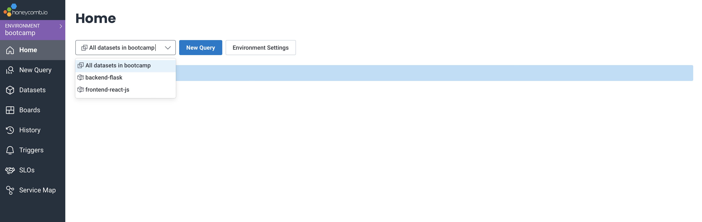

    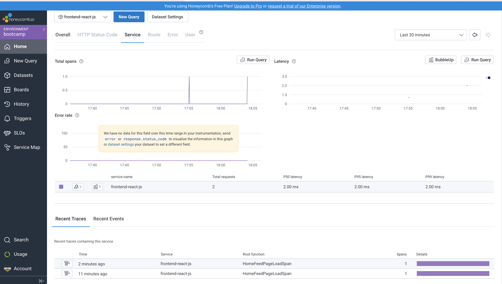

    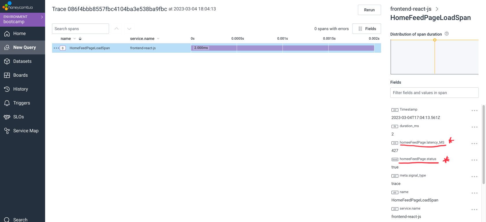

    


### **Adding Custom Span to capture UserID and creating custom queries**
1. In the [backend/services](../backend-flask/services/) folder, the [user_activities.py](../backend-flask/services/user_activities.py) file was modified to capture the UserID used for searching for a user activities:
```python
from datetime import datetime, timedelta, timezone
from opentelemetry import trace

tracer = trace.get_tracer("user-activities")

class UserActivities:
  def run(user_handle):
    with tracer.start_as_current_span("user-data-activities"): # start a new custom spam called user-data
      span = trace.get_current_span()
      model = {
        'errors': None,
        'data': None
      }

      now = datetime.now(timezone.utc).astimezone()
      span.set_attribute("user.now", now.isoformat())

      if user_handle == None or len(user_handle) < 1:
        model['errors'] = ['blank_user_handle']
      else:
        now = datetime.now()
        span.set_attribute("user.now", now.isoformat() # capture the time
        span.set_attribute("UserID", user_handle) # capture the user id
        results = [{
          'uuid': '248959df-3079-4947-b847-9e0892d1bab4',
          'handle':  'Andrew Brown',
          'message': 'Cloud is fun!',
          'created_at': (now - timedelta(days=1)).isoformat(),
          'expires_at': (now + timedelta(days=31)).isoformat()
        }]
        span.set_attribute("user.activities.len", len(result)) # capture the number of active user activities 
        model['data'] = results
      return model
```
2. Result from instrumenting the user activities can be seen below:
  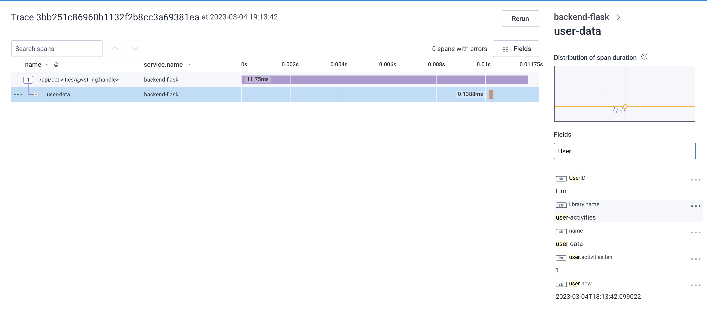

3. After using loading different user activities, a P90 query on the duration(ms) grouped by UserID was run to show the latency of opening the each user activities:
  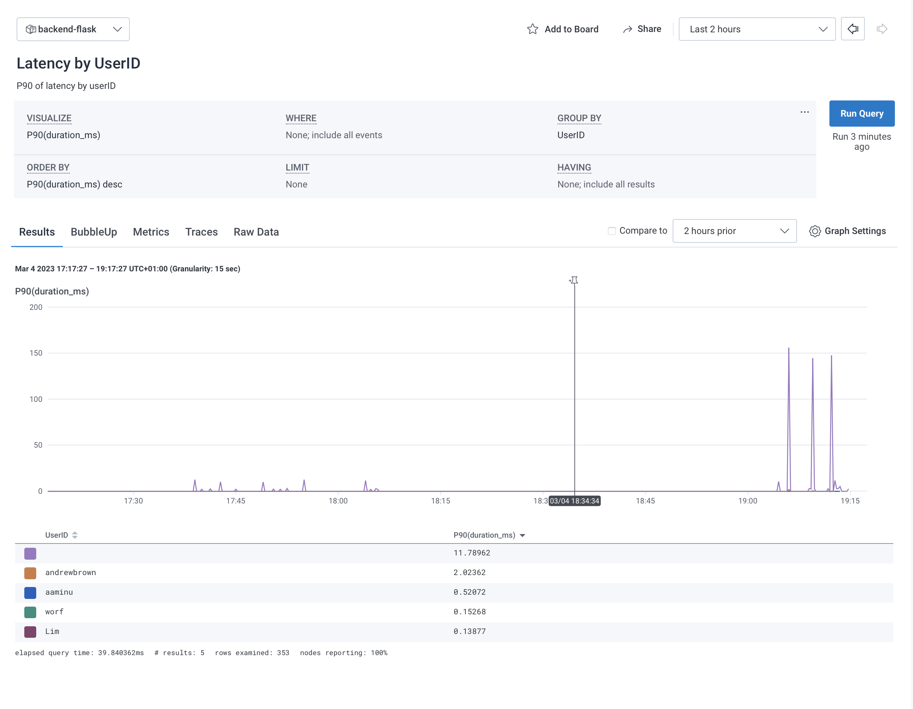

4. A count query was also performed for the frontend Homepage API call to indicate where the duration was less or equal to 500ms:
  

5. Lastly, saved the queries for later use:
  


### **Adding Custom Subsegment for AWS_XRAY**
1. To keep an eye on the cost, I only implemented a simple subgement in the [notifications_activities.py](../backend-flask/services/notifications_activities.py) file. To achieve this, I didn't have to make any change to the [app.py](../backend-flask/app.py) file except what was described in the previous xray chapter. The content added to the notifications file is:
```python
from datetime import datetime, timedelta, timezone
from aws_xray_sdk.core import xray_recorder

class NotificationsActivities:

  def run():
    with xray_recorder.capture('notifications-sub') as subsegment: # start a capture session with context manager
      now = datetime.now(timezone.utc).astimezone()

      results = [{
        'uuid': '68f126b0-1ceb-4a33-88be-d90fa7109eee',
        'handle':  'aaminu',
        'message': 'I am finding #cloudcamp fun. :)'`
        'created_at': (now - timedelta(days=2)).isoformat(),
        'expires_at': (now + timedelta(days=5)).isoformat(),
        'likes_count': 5,
        'replies_count': 1,
        'reposts_count': 0,
        'replies': [{
          'uuid': '26e12864-1c26-5c3a-9658-97a10f8fea67',
          'reply_to_activity_uuid': '68f126b0-1ceb-4a33-88be-d90fa7109eee',
          'handle':  'Worf',
          'message': 'This is the post!',
          'likes_count': 0,
          'replies_count': 0,
          'reposts_count': 0,
          'created_at': (now - timedelta(days=2)).isoformat()
        }],
      },
      {
        'uuid': '66e12864-8c26-4c3a-9658-95a10f8fea67',
        'handle':  'lim<3',
        'message': 'Hey aaminu, what\'s good?',
        'created_at': (now - timedelta(days=7)).isoformat(),
        'expires_at': (now + timedelta(days=9)).isoformat(),
        'likes': 0,
        'replies': []
      }
      ]
      subsegment.put_annotation('notifications_now', now.isoformat()) # Add Annotations
      subsegment.put_annotation('notif_result_length', len(results))  # Add Annotations
      return results
``` 

2. In aws console, the traces from doing a custom instrumentation in the [notifications_activities.py](../backend-flask/services/notifications_activities.py) file can be seen below. The subsegment name and annotation matches what was set in the file:

  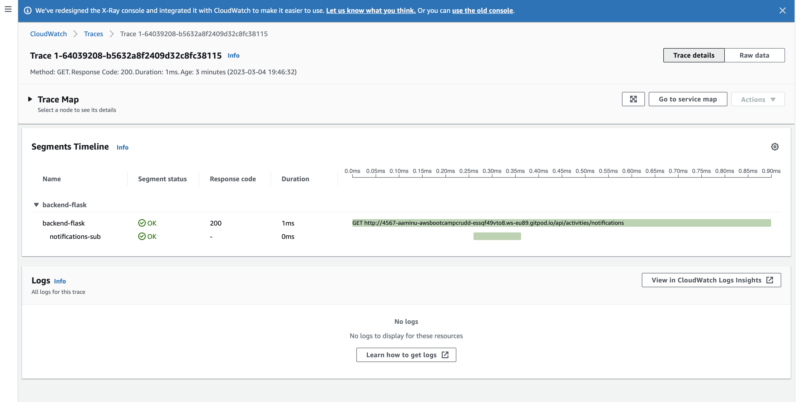

  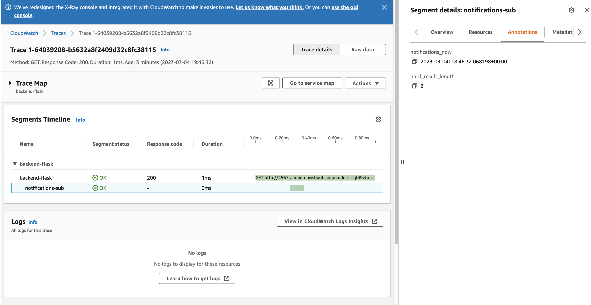

3. The raw json output of the custom subsegment from the backend trace is also shown below:

  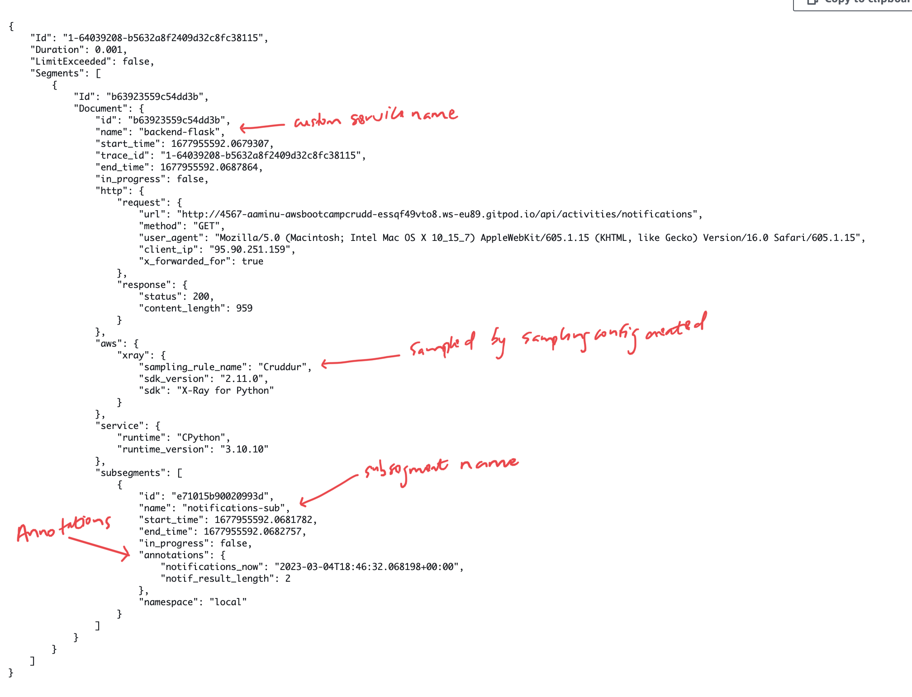