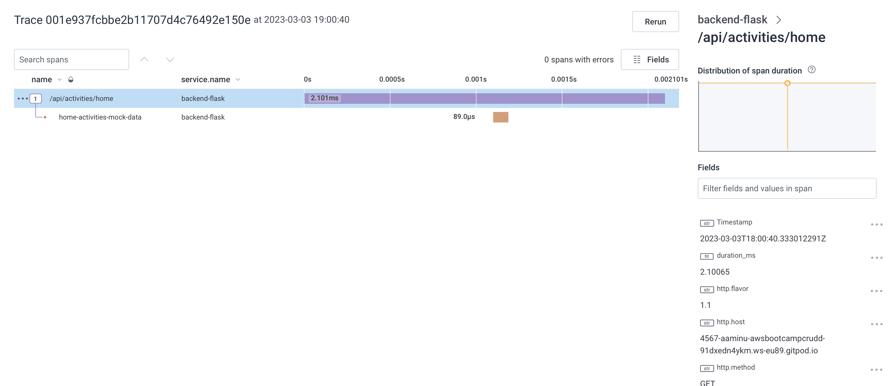

# Week 2 — Distributed Tracing
## Required Homework

### Distrbuted Tracing with Honeycomb
1. Created a trial account at [honeycomb.io](https://ui.honeycomb.io/)
2. Created a new enviroment and attained the api key
3. Persisted the Api key to my gitpod enviroment by doing
    ```bash
    $ gp env HONEYCOMB_API_KEY="<API Key>"
    HONEYCOMB_API_KEY="<API Key>"
    ```
4. To ensure my key is propagated across all shells, the workspace was closed and a new one opened.
5. To ensure all dependencies(Open telemetry "OTEL") are met, thee following was added to the [requirements.txt](../backend-flask/requirements.txt) file:
    ```txt
    opentelemetry-api 
    opentelemetry-sdk 
    opentelemetry-exporter-otlp-proto-http 
    opentelemetry-instrumentation-flask 
    opentelemetry-instrumentation-requests
    ```
6. The [docker-compose.yml](../docker-compose.yml) file was also updated to reflect neccessary enivorment keys:
    ````yaml
    version: "3.8"
    services:
    backend-flask:
        environment:
        ...
        ...
        OTEL_SERVICE_NAME: "backend-flask"
        OTEL_EXPORTER_OTLP_ENDPOINT: "https://api.honeycomb.io"
        OTEL_EXPORTER_OTLP_HEADERS: "x-honeycomb-team=${HONEYCOMB_API_KEY}"
        ...
    ```
7. Next, to start getting traces in honeycomb, I added the following to the [app.py](../backend-flask/app.py):
    ```python
    ...
    ...

    # Honeycomb
    from opentelemetry import trace
    from opentelemetry.instrumentation.flask import FlaskInstrumentor
    from opentelemetry.instrumentation.requests import RequestsInstrumentor
    from opentelemetry.exporter.otlp.proto.http.trace_exporter import OTLPSpanExporter
    from opentelemetry.sdk.trace import TracerProvider
    from opentelemetry.sdk.trace.export import BatchSpanProcessor

    # Initialize tracing and an exporter that can send data to Honeycomb
    provider = TracerProvider()
    processor = BatchSpanProcessor(OTLPSpanExporter())
    provider.add_span_processor(processor)
    trace.set_tracer_provider(provider)
    tracer = trace.get_tracer(__name__)


    app = Flask(__name__)

    # Initialize automatic instrumentation with Flask
    FlaskInstrumentor().instrument_app(app)
    RequestsInstrumentor().instrument()
    ```
8. Finally, it was time to run ```docker compose up``` and see if traces are recieved in honeycomb.
9. Below is a proof of trace in honeycomb platform.
    

    


### Distrbuted Tracing with AWS Xray
1. To get started with aws-xray, the following was added to the [requirements.txt](../backend-flask/requirements.txt) file to ensure the necessary sdk was dowmnloaded:
    ```txt
    aws-xray-sdk
    ```
2. In the [docker-compose.yml](../docker-compose.yml) file, the following was added:
    ```yaml
    version: "3.8"
    services:
    backend-flask:
        environment:
        ...
        AWS_XRAY_URL: "*4567-${GITPOD_WORKSPACE_ID}.${GITPOD_WORKSPACE_CLUSTER_HOST}*"
        AWS_XRAY_DAEMON_ADDRESS: "xray-daemon:2000"
              
        ...
    xray-daemon:
        image: "amazon/aws-xray-daemon"
        environment:
        AWS_ACCESS_KEY_ID: "${AWS_ACCESS_KEY_ID}"
        AWS_SECRET_ACCESS_KEY: "${AWS_SECRET_ACCESS_KEY}"
        AWS_REGION: "us-east-1"
        command:
        - "xray -o -b xray-daemon:2000"
        ports:
        - 2000:2000/udp
    ```
3. The above sets the required enviroment variables and also defines the conntainer for the xray-daemon.
4. Next was to create a group on aws-xray to ensure we could group our traces. The following command as issued in the terminal since aws cli is already installed:
    ```bash
    $ aws xray create-group \
    --group-name "Cruddur" \
    --filter-expression "service(\"backend-flask\")"
    ```
5. The above should return a response with the arn and other parameters to indicate success
6. To create a samplinng rule for xray-services, a file was created in [aws-bootcamp-cruddur-2023/aws/json](../aws/json/) called [xray.json](../aws/json/xray.json) with content:
    ```json
    {
    "SamplingRule": {
        "RuleName": "Cruddur",
        "ResourceARN": "*",
        "Priority": 9000,
        "FixedRate": 0.1,
        "ReservoirSize": 5,
        "ServiceName": "backend-flask",
        "ServiceType": "*",
        "Host": "*",
        "HTTPMethod": "*",
        "URLPath": "*",
        "Version": 1
        }
    }
    ```
7. In the terminal, the following command was issued: 
    ```bash
    $ aws xray create-sampling-rule --cli-input-json file://aws/json/xray.json
    ```
8. In the [app.py](../backend-flask/app.py), the following was added:
    ```python
    ...
    ...

    # X_RAY
    from aws_xray_sdk.core import xray_recorder
    from aws_xray_sdk.ext.flask.middleware import XRayMiddleware

    xray_url = os.getenv("AWS_XRAY_URL")
    #xray_recorder.configure(service='backend-flask', dynamic_naming=xray_url)
    xray_recorder.configure(service='backend-flask') # To ensure all traces can be grouped under the Cruudr group created
    
    ......
    ......

    app = Flask(__name__)

    #XRAY
    XRayMiddleware(app, xray_recorder)
    ```
9. A slight change from what was provided in andrew's instruction was implemented above, these allowed me to be able to group all the traces undeet the Cruudr groupname
10. Started my containers and inspected aws xray in the aws console, please seee evidence of traces in xray:
    
    

    Raw Output of the image above:
    ```json
    {
        "Id": "1-6402419b-50dd9a4d9fecfdf309458aaa",
        "Duration": 0.001,
        "LimitExceeded": false,
        "Segments": [
            {
                "Id": "eb5ca210c8961d0e",
                "Document": {
                    "id": "eb5ca210c8961d0e",
                    "name": "backend-flask",
                    "start_time": 1677869467.2860286,
                    "trace_id": "1-6402419b-50dd9a4d9fecfdf309458aaa",
                    "end_time": 1677869467.2867994,
                    "in_progress": false,
                    "http": {
                        "request": {
                            "url": "http://4567-aaminu-awsbootcampcrudd-91dxedn4ykm.ws-eu89.gitpod.io/api/activities/home",
                            "method": "GET",
                            "user_agent": "curl/7.64.0",
                            "client_ip": "34.79.69.113",
                            "x_forwarded_for": true
                        },
                        "response": {
                            "status": 200,
                            "content_length": 1235
                        }
                    },
                    "aws": {
                        "xray": {
                            "sampling_rule_name": "Cruddur",
                            "sdk_version": "2.11.0",
                            "sdk": "X-Ray for Python"
                        }
                    },
                    "service": {
                        "runtime": "CPython",
                        "runtime_version": "3.10.10"
                    }
                }
            }
        ]
    }
    ```
### Loggig with AWS CloudWatch
1. As usual, added the required library/SDK to the [requirements.txt](../backend-flask/requirements.txt):
    ```txt
    watchtower
    ```
2. In the [docker-compose.yml](../docker-compose.yml) file, the following was added:
    ```yaml
    version: "3.8"
    services:
    backend-flask:
        environment:
        ...
        AWS_DEFAULT_REGION: "${AWS_DEFAULT_REGION}"
        AWS_ACCESS_KEY_ID: "${AWS_ACCESS_KEY_ID}"
        AWS_SECRET_ACCESS_KEY: "${AWS_SECRET_ACCESS_KEY}"
              
        ...
    ```
3. In [app.py](../backend-flask/app.py), the following was added:
    ```python
    ...
    #Cloudwatch Logs
    import watchtower
    import logging
    from time import strftime

    ...
    
    # Configuring Logger to Use CloudWatch
    LOGGER = logging.getLogger(__name__)
    LOGGER.setLevel(logging.DEBUG)
    console_handler = logging.StreamHandler()
    cw_handler = watchtower.CloudWatchLogHandler(log_group='cruddur')
    LOGGER.addHandler(console_handler)
    LOGGER.addHandler(cw_handler)
    LOGGER.info("Test Message")

    app = Flask(__name__)

    ...

    @app.after_request
    def after_request(response):
        timestamp = strftime('[%Y-%b-%d %H:%M]')
        LOGGER.error('%s %s %s %s %s %s', timestamp, request.remote_addr, request.method, request.scheme, request.full_path, response.status)
        return response
    ```
4. The compose up commannd, after a while of the container running and refreshing the pages, logs appeared on cloudwatch logs. Please see below
    


### Loggig with Rollbar
1. Started by creating an account onnn [rollbar](https://rollbar.com), selected the right framework that for and copied the required api-key.

2. Persisted the key in the gitpod enivorment with name *ROLLBAR_ACCESS_TOKEN*. I reopened a new workspace to ensure the all enviroment keys are present

3. In the [requirements.txt](../backend-flask/requirements.txt), the following was added:
    ```txt
    blinker
    rollbar
    ```
4. In the [docker-compose.yml](../docker-compose.yml) file, the following was added:

    ```yaml
    version: "3.8"
    services:
    backend-flask:
        environment:
        ...

        ROLLBAR_ACCESS_TOKEN: "${ROLLBAR_ACCESS_TOKEN}"        
        ...
    ```
5. In [app.py](../backend-flask/app.py), the following was also added:
    ```python
    ...
    #Rollbar
    import rollbar
    import rollbar.contrib.flask
    from flask import got_request_exception

    ...

    app = Flask(__name__)

    ...

    # Rollbar Intialize
    rollbar_access_token = os.getenv('ROLLBAR_ACCESS_TOKEN')
    @app.before_first_request
    def init_rollbar():
        """init rollbar module"""
        rollbar.init(
            # access token
            rollbar_access_token,
            # environment name
            'production',
            # server root directory, makes tracebacks prettier
            root=os.path.dirname(os.path.realpath(__file__)),
            # flask already sets up logging
            allow_logging_basic_config=False)

        # send exceptions from `app` to rollbar, using flask's signal system.
        got_request_exception.connect(rollbar.contrib.flask.report_exception, app)

    @app.route('/rollbar/test')
    def rollbar_test():
        rollbar.report_message('Hello World!', 'warning')
        return "Hello World!"
    ```
6. Compose up and running the endpoint at /rollbar/test, the following log was seen on rollbar:
    


## Homework Challenges 