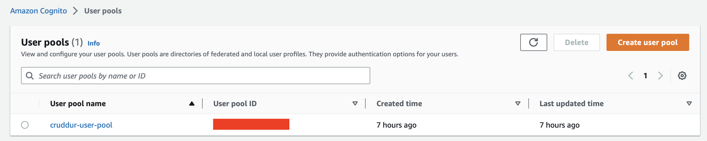
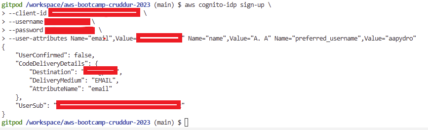
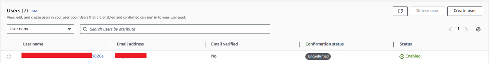
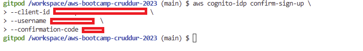
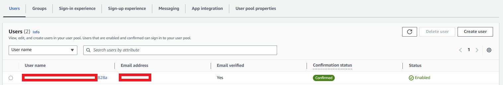
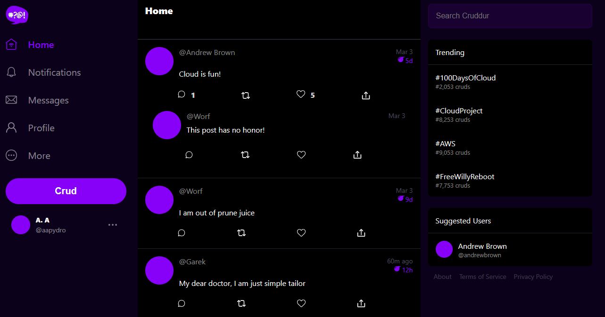
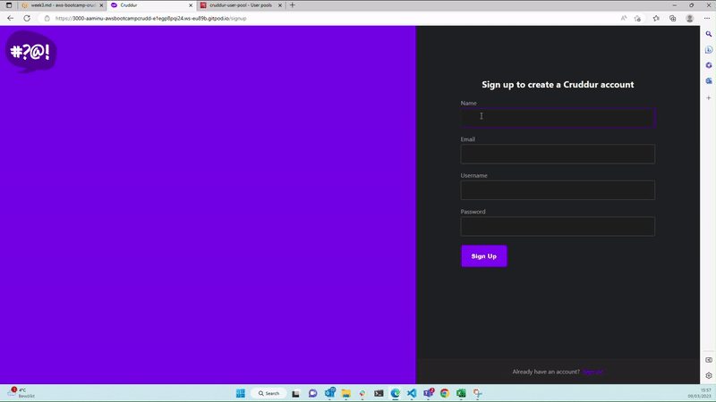
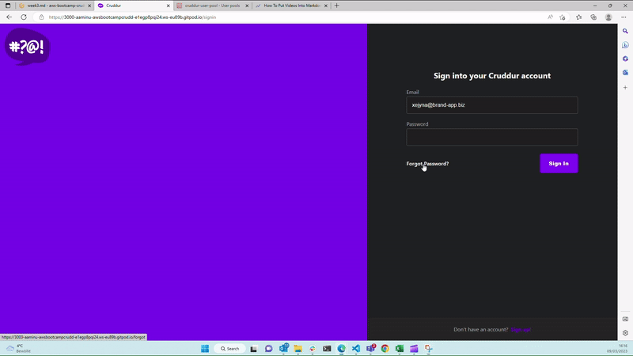
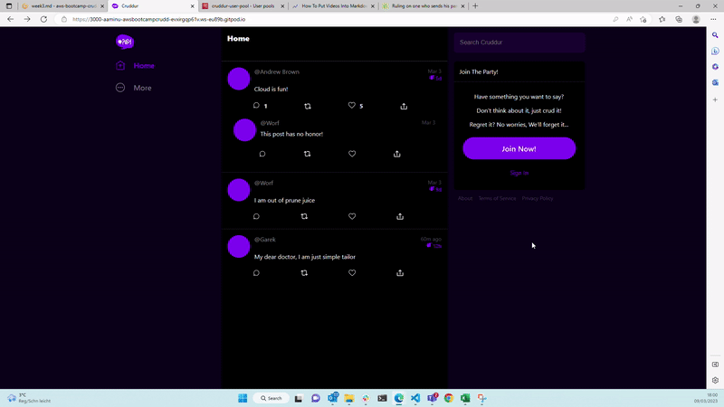

# Week 3 — Decentralized Authentication

## **Required Homework ** 

### **Setup Cognito User Pool**
Provision a user pool in aws cognito via click-ops involves having valid aws account. The following approach was implemented:
1. Logged into my aws account with the appropriate credentials
2. Used the searchbox to find and open cognito
3. While in cognito, confirmed the region I wanted was right
4. Started by clicking *Create user pool*
5. Fields that required different options from the defaults are highlighted below:
    - Cognito user pool sign-in options: Email
    - Multi-factor authentication: No MFA
    - Required attributes (Additional required attributes): name, preferred_username
    - Email (Email provider): Send email with Cognito
    - User pool name: *Choose any name*
    - App client name: *Choose any name*
6. Reviewed and completed the creation by clicking the *Create user pool*
7. The resultant page is shown below: 

    

### **Setup Environment Variables for Frontend and Enabling Signing in**
1. To interact with aws-cognito from the frontend, we need to install aws-amplify nodes. From the command line, I navigated to the frontend folder. Then I ran the following command:
```bash
$ npm i aws-amplify --save
````
2. To ensure it is always included in the node modules, I added the above package to the [.gitpod.yml](../.gitpod.yml) file:
```yaml
  - name: npm-init
    init: |
      cd /workspace/aws-bootcamp-cruddur-2023/frontend-react-js
      npm i --save \
        @opentelemetry/api \
        @opentelemetry/sdk-trace-web \
        @opentelemetry/exporter-trace-otlp-http \
        @opentelemetry/instrumentation-document-load \
        @opentelemetry/context-zone \
        aws-amplify
```
3. I retrieved the *User pool ID* from the image above. I also retrieved the "Client ID" by clicking on the user pool name, then *App Integration*, and finally in the *App clients and analytics*.
4. Since I prefer the CLI, I tried using the aws cli to retrieve both parameter with the following commands:
```bash
$ aws cognito-idp list-user-pools --max-results 1
{
    "UserPools": [
        {
            "Id": "UserPoolIdAppearsHere",
            "Name": "cruddur-user-pool",
            "LambdaConfig": {},
            "LastModifiedDate": "2023-03-08T08:11:08.256000+00:00",
            "CreationDate": "2023-03-08T08:11:08.256000+00:00"
        }
    ]
}
$ aws cognito-idp list-user-pool-clients --user-pool-id "UserPoolIDFromAbove"
{
    "UserPoolClients": [
        {
            "ClientId": "ClientIdAppearsHere",
            "UserPoolId": "UserPoolIdAppearsHere",
            "ClientName": "cruddur"
        }
    ]
}
```
5. While still in the terminal, the following was done to persist the two key from above:
```bash
$ gp env AWS_USER_POOLS_ID="<User Pool Id>"
$ gp env COGNITO_APP_CLIENT_ID="<Client ID>"
```
6. In the [docker-compose](../docker-compose.yml) file, the following environment variables was added underneath the *frontend-react-js* service:
```yaml
version: "3.8"
services:
  # Other Service....
  frontend-react-js:
    environment:
      REACT_APP_BACKEND_URL: "https://4567-${GITPOD_WORKSPACE_ID}.${GITPOD_WORKSPACE_CLUSTER_HOST}"
      REACT_APP_OLTP_URL: "https://4318-${GITPOD_WORKSPACE_ID}.${GITPOD_WORKSPACE_CLUSTER_HOST}"
      # Added the below
      REACT_APP_AWS_PROJECT_REGION: "${AWS_DEFAULT_REGION}"
      REACT_APP_AWS_COGNITO_REGION: "${AWS_DEFAULT_REGION}"
      REACT_APP_AWS_USER_POOLS_ID: "${AWS_USER_POOLS_ID}"
      REACT_APP_CLIENT_ID: "${COGNITO_APP_CLIENT_ID}"
    build: ./frontend-react-js
    # .....

```
7. To configure the aws-amplify, the following was added in the [App.js](../frontend-react-js/src/App.js) file:
```js
//Previous imports...

import { Amplify } from 'aws-amplify';

Amplify.configure({
  "AWS_PROJECT_REGION": process.env.REACT_APP_AWS_PROJECT_REGION,
  "aws_cognito_region": process.env.REACT_APP_AWS_COGNITO_REGION,
  "aws_user_pools_id": process.env.REACT_APP_AWS_USER_POOLS_ID,
  "aws_user_pools_web_client_id": process.env.REACT_APP_CLIENT_ID,
  "oauth": {},
  Auth: {
    region: process.env.REACT_APP_AWS_PROJECT_REGION,           // REQUIRED - Amazon Cognito Region
    userPoolId: process.env.REACT_APP_AWS_USER_POOLS_ID,         // OPTIONAL - Amazon Cognito User Pool ID
    userPoolWebClientId: process.env.REACT_APP_CLIENT_ID,   // OPTIONAL - Amazon Cognito Web Client ID (26-char alphanumeric string)
  }
});

//...
```
8. To also customize the home-feed page based on authenticated user, the following modifications were made to the [HomeFeedPage.js](../frontend-react-js/src/pages/HomeFeedPage.js):
    - Imported aws-amplify
    ```js
    import './HomeFeedPage.css';
    import React from "react";

    //AWS Amplify
    import { Auth } from 'aws-amplify';

    import DesktopNavigation  from '../components/DesktopNavigation';
    import DesktopSidebar     from '../components/DesktopSidebar';
    //...
    ```
    - In the same file, replace the *checkAuth* method/function with:
    ```js
    // check if we are authenticated
    const checkAuth = async () => {
    Auth.currentAuthenticatedUser({
        // Optional, By default is false. 
        // If set to true, this call will send a 
        // request to Cognito to get the latest user data
        bypassCache: false 
    })
    .then((user) => {
        console.log('user',user);
        return Auth.currentAuthenticatedUser()
    }).then((cognito_user) => {
        setUser({
            display_name: cognito_user.attributes.name,
            handle: cognito_user.attributes.preferred_username
        })
    })
    .catch((err) => console.log(err));
    };
    ```
9. To enable signing in with a cognito username, the following modifiications were made to the [SigninPage.js](../frontend-react-js/src/pages/SigninPage.js) file:
    - Replaced the import underneath the *// [TODO] Authenication* with:
    ```js
    import { Auth } from 'aws-amplify';
    ```
    - Replaced the *onSubmit* method/function with:
    ```js
    const onsubmit = async (event) => {
     event.preventDefault();

     Auth.signIn(email, password)
       .then(user => {
         localStorage.setItem("access_token", user.signInUserSession.accessToken.jwtToken)
         window.location.href = "/"
       })
       .catch(error => { if (error.code == 'UserNotConfirmedException') {
         window.location.href = "/confirm"
       }
       setErrors(error.message) });

     return false
   }
   ```
10. Finally, to allow user sign-out, the [ProfileInfo.js](../frontend-react-js/src/components/ProfileInfo.js) file was modified as follows:
    - Replace the import underneath the *// [TODO] Authenication* with:
    ```js
    import { Auth } from 'aws-amplify';
    ```
    - Replace the *signOut* method with:
    ```js
    const signOut = async () => {
     try {
         await Auth.signOut({ global: true });
         window.location.href = "/"
     } catch (error) {
         console.log('error signing out: ', error);
        }
    }
    ```


11. At this point, I committed the code and pushed to Github. Closed the current workspace and opened a totally new one. This approach ensures that all environment keys propagate properly.

**NB:** To test the above, one needs to create a user using clickops on aws-cognito page underneath the user pool created. Also, we need to use the aws-cli to set a password with admin rights so as to avoid verification. The command to do that is:
```bash
$ aws cognito-idp admin-set-user-password \
 --user-pool-id <your-user-pool-id> \
 --username <username> \
 --password <password> \
 --permanent
```
Or if you like the cli like me, you can use the following command to register and confirm the user
```bash
 $ aws cognito-idp sign-up \
  --client-id <your-client-id> \
  --username <email-address> \
  --password <PASSWORD> \
  --user-attributes Name="email",Value=<email-address> Name="name",Value=<your-name> Name="preferred_username",Value=<preferred-username>
```
And to confirm after receiving an email
```bash
 $ aws cognito-idp confirm-sign-up \
  --client-id <your-client-id> \
  --username <email-address> \
  --confirmation-code <Confirmation-Code>
```
See below for picture evidence using the above:
- Registering a user:

  

- Unconfirmed user in Cognito:

  

- Verfication email:

  

- Confirmation via cli:

  
  

- Logged-in user

  


### **Implementing Custom Signup, Confirmation, and Recovery Page**

Similar to the previous section, I added the auth library to the respective sections as per instruction:

1. In the [SignupPage.js](../frontend-react-js/src/pages/SignupPage.js) file:
    - I replaced the cookies import and the onSubmit method:

    ```
    //other imports

    //Authenication
    import { Auth } from 'aws-amplify';
    ```
    - Replaced the onSubmit method:
    ```js
    //other imports

    const onsubmit = async (event) => {
      event.preventDefault();
      setErrors('')
      try {
          const { user } = await Auth.signUp({
            username: email,
            password: password,
            attributes: {
              name: name,
              email: email,
              preferred_username: username,
            },
            autoSignIn: { // optional - enables auto sign in after user is confirmed
              enabled: true,
            }
          });
          console.log(user);
          window.location.href = `/confirm?email=${email}`
      } catch (error) {
          console.log(error);
          setErrors(error.message)
      }
      return false
    }
    ```
2. In the [ConfirmationPage.js](../frontend-react-js/src/pages/ConfirmationPage.js) file: 
   - I replaced the cookies import and the onSubmit method:
    ```js
    //other imports

    //Authenication
    import { Auth } from 'aws-amplify';
    ```
    - Replaced both resend-code and onSubmit methods:
    ```js
    const resend_code = async (event) => {
      setErrors('')
      try {
        await Auth.resendSignUp(email);
        console.log('code resent successfully');
        setCodeSent(true)
      } catch (err) {
        console.log(err)
        if (err.message == 'Username cannot be empty'){
          setErrors("You need to provide an email in order to send Resend Activiation Code")   
        } else if (err.message == "Username/client id combination not found."){
          setErrors("Email is invalid or cannot be found.")   
        }
      }
    }

    const onsubmit = async (event) => {
      event.preventDefault();
      setErrors('')
      try {
        await Auth.confirmSignUp(email, code);
        window.location.href = "/"
      } catch (error) {
        setErrors(error.message)
      }
      return false
    }
    ```

3. Finally in the [RecoverPage.js](../frontend-react-js/src/pages/RecoverPage.js) file:
    - Imported the auth library

    ```js
    //other imports
    import { Auth } from 'aws-amplify';
    ```

    - Replaced the onsubmit_send_code and onsubmit_confirm_code methods:

    ```js
    const onsubmit_send_code = async (event) => {
      event.preventDefault();
      setErrors('')
      Auth.forgotPassword(username)
      .then((data) => setFormState('confirm_code') )
      .catch((err) => setErrors(err.message) );
      return false
    }

    const onsubmit_confirm_code = async (event) => {
      event.preventDefault();
      setErrors('')
      if (password == passwordAgain){
        Auth.forgotPasswordSubmit(username, code, password)
        .then((data) => setFormState('success'))
        .catch((err) => setErrors(err.message) );
      } else {
        setErrors('Passwords do not match')
      }
      return false
    }
    ```

4. Test the above by registering a new user. Please see the gif below as evidence:

    

5. Test for recovering password is shown below:

    

### **Cognito Backend Server Verify**
This section contains work done to send the JWT to the backend server, verify it and render a provide a different Home timeline based on the outcome of the verification. Certain code chunks are different from the instructions in the video.

1. To get the Homepage to include the JWT as part of it request header when talking to the backend server, the following was added to the  [HomeFeedPage.js](../frontend-react-js/src/pages/HomeFeedPage.js) file:

    ```js
    const loadData = async () => {
        try {
          const backend_url = `${process.env.REACT_APP_BACKEND_URL}/api/activities/home`
          var startTime = performance.now()
          const res = await fetch(backend_url, {
            headers: {
              // ******Add JWT to request Header*******
              Authorization: `Bearer ${localStorage.getItem("access_token")}`
            },
            method: "GET"
          });
          // Other part of the method/function .....
      };
    ```
2. In the [app.py](../backend-flask/app.py) file, changes to the *CORS* initialization is made to ensure communication isn't aborted due to cors. The following was added:
    ```py
    cors = CORS(
      app, 
      resources={r"/api/*": {"origins": origins}},
      expose_headers="location,link",
      allow_headers="content-type,if-modified-since",
      expose_headers="location,link,Authorization",
      headers=['Content-Type', 'Authorization'], 
      methods="OPTIONS,GET,HEAD,POST"
    )
    ```
3. To test this two changes, a logger was placed on the decorated *data_home()* function to see if a token is sent from the frontend when an authenticated user logs in or refreshes the page

4. To verify the the token received, an external library called *Flask-AWSCognito* was added to the end of the [requirements.txt](../backend-flask/requirements.txt) file. Also new folder [lib](../backend-flask/lib/) in the backend directory was created. Within the folder, a module called 
[cognito_jwt_token.py](../backend-flask/lib/cognito_jwt_token.py). Please click on file to take a look at it's content

5. In the [app.py](../backend-flask/app.py) file, a object of type *CognitoJwtToken* was imported and initialized by adding the following:
    ```py
    #Other Imports ....

    #import token verifyer
    from lib.cognito_jwt_token import TokenVerifyError, CognitoJwtToken


    app = Flask(__name__)

    #JWT Token
    cognito_jwt_token = CognitoJwtToken(
                              user_pool_id = os.getenv("AWS_COGNITO_USER_POOLS_ID"), 
                              user_pool_client_id = os.getenv("AWS_COGNITO_CLIENT_ID"), 
                              region = os.getenv("AWS_DEFAULT_REGION")
                              )
    ```

6. In the same file as above, I modified the *data_home()* method as following:
    ```py
    @app.route("/api/activities/home", methods=['GET'])
    def data_home():

      access_token = cognito_jwt_token.extract_access_token(request.headers)
      if access_token == "null": #empty accesstoken
        data = HomeActivities.run()
        return data, 200
      
      # If token isn't null
      try:
        cognito_jwt_token.verify(access_token)
        app.logger.debug("Authenicated")
        app.logger.debug(f"User: {cognito_jwt_token.claims['username']}")
        data = HomeActivities.run(cognito_user=cognito_jwt_token.claims['username'])
      except TokenVerifyError as e:
        app.logger.debug("Authentication Failed")
        app.logger.debug(e)
        data = HomeActivities.run()

      return data, 200
    ```
7. In the [home_activities.py](../backend-flask/services/home_activities.py) file, the class method *run()* was modified to accept a user and show an additional crud :

    ```py
    class HomeActivities:
      def run(logger=None, cognito_user=None): # add cognito_user
        # logger.info("Test from Home Activities")
        with tracer.start_as_current_span("home-activities-mock-data"):
          
          # ... Other parts

          if cognito_user is not None:
            extra_crud = {
              'uuid': '248959df-3079-4947-b847-9e0892d1bab4',
              'handle':  'Abby',
              'message': 'Always ready to give it my all...',
              'created_at': (now - timedelta(hours=1)).isoformat(),
              'expires_at': (now + timedelta(hours=12)).isoformat(),
              'likes': 600,
              'replies': []
            }
            results.insert(0,extra_crud)
          span.set_attribute("app.result_length", len(results))
          return results
    ```
8. Before Testing, I added the enviroment variables to [docker-compose.yml](../docker-compose.yml) file for the backend services:
    ```yaml
    version: "3.8"
    services:
      backend-flask:
        environment:
          # Other Environment variables
          AWS_COGNITO_USER_POOLS_ID: "${AWS_USER_POOLS_ID}"
          AWS_COGNITO_CLIENT_ID: "${COGNITO_APP_CLIENT_ID}"
    ```

9. Lastly, I ensured the jwt is removed when the user logs out by making the a modification to *signOut* method in [ProfileInfo.js](../frontend-react-js/src/components/ProfileInfo.js):
    ```js
    const signOut = async () => {
      try {
          await Auth.signOut({ global: true });
          window.location.href = "/"
          localStorage.removeItem("access_token") // Remove token when user logs out.
      } catch (error) {
          console.log('error signing out: ', error);
      }
    }
    ```

10. Please see evidence below:
    