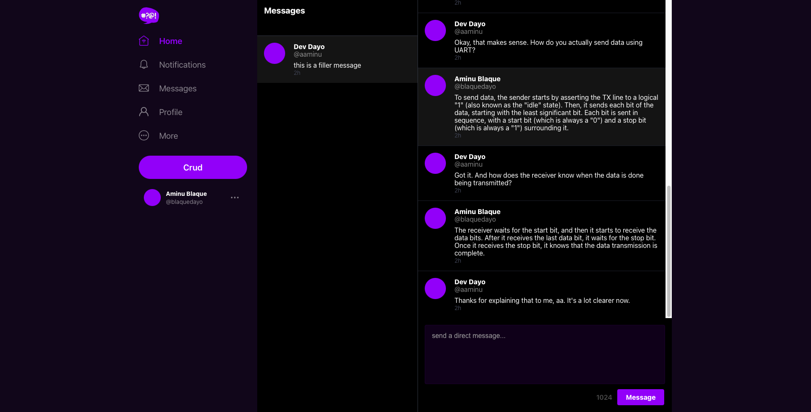
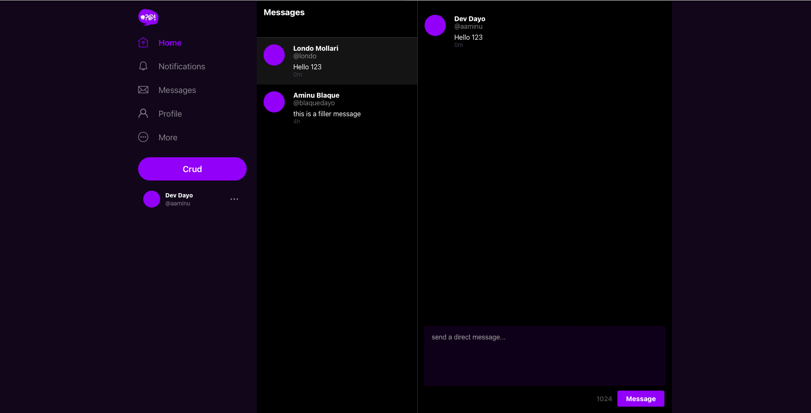
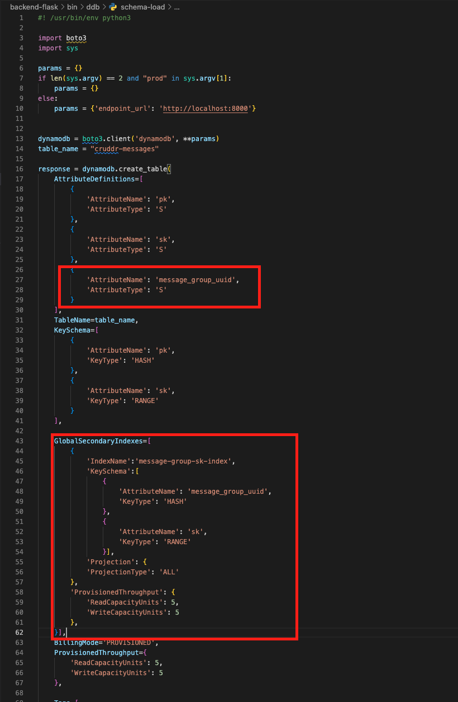
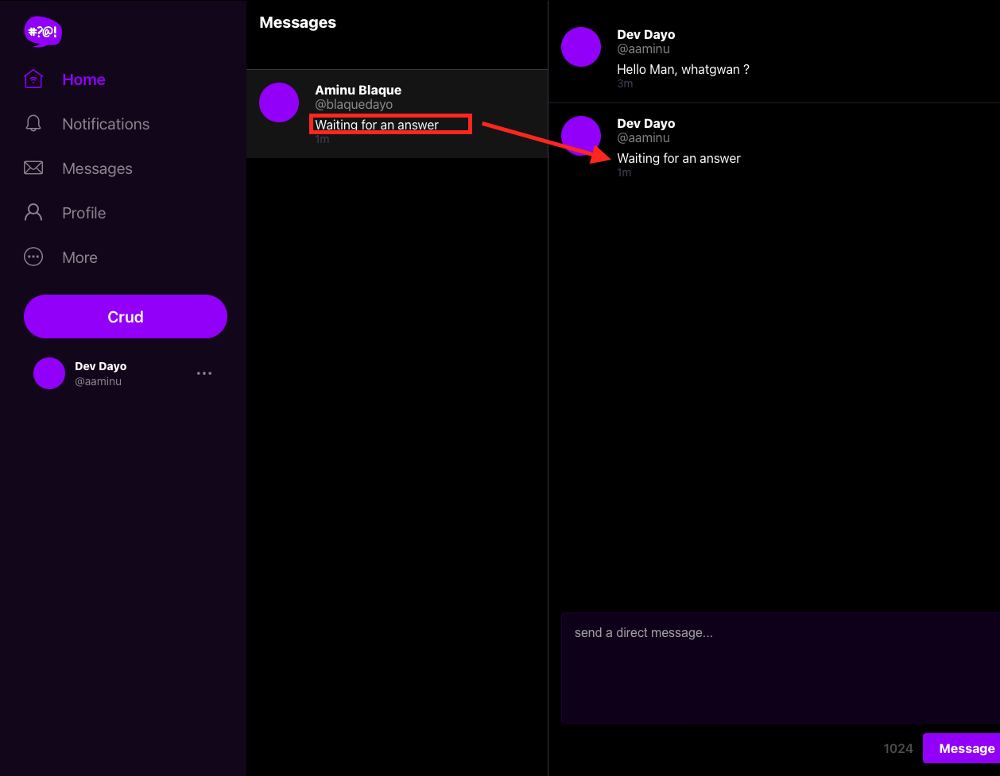

# Week 5 — DynamoDB and Serverless Caching

## **Required Homework** 

### **Scripts for DynamoDb**

Started this week by refactoring the [/backend-flask/bin](../backend-flask/bin) folder to provide the proper structure, with the new structure looking like:
```
bin
|--db
   |--connect
   |--create
   |--drop
   |--schema-load
   |--seed
   |--session
   |--setup
|--ddb
|--rds
   |--update-sg-rule
```
Afterwards, the following was done to adjust and reflect the changes from above where required:
1. In [bin/schema-load](../backend-flask/bin/db/schema-load) and [bin/seed](../backend-flask/bin/db/seed), the parent file directory is updated to reflect the current path. This done by replacing:
    ```bash
    file_parent_dir=`dirname $(dirname $(dirname $current_file_path))`
    ```

2. In [bin/setup](../backend-flask/), the following was edited:
    ```bash
    bin_db_dir=`dirname $current_file_path`

    source $bin_db_dir/drop
    source $bin_db_dir/create
    source $bin_db_dir/schema-load
    source $bin_db_dir/seed
    ```

3. In the [.gitpod.yml](../.gitpod.yml) file, the command section of postgres task was updated:
    ```yaml
        command: |
            export GITPOD_IP=$(curl ifconfig.me)
            source "$THEIA_WORKSPACE_ROOT/backend-flask/bin/rds/update-sg-rule"
    ```

4. Updated the [schema.sql](../backend-flask/db/schema.sql) and [seed.sql](../backend-flask/db/seed.sql) to include required email address.

5. Ran the following command to setup and seed thee postgres db
    ```bash
    aws-bootcamp-cruddur-2023 $ ./backend-flask/bi/db/setup

    ```


To get the dynamodb going, the following was implemented:

1. In the [requirement.txt](../backend-flask/requirements.txt), I appended ```boto3```  to the end and ran ```pip install -r requirement.txt```in the terminal.
2. Created all the required scripts in the [/backend-flask/bin/ddb](../backend-flask/bin) [/backend-flask/bin](../backend-flask/bin/ddb/) folder.
3. In some of the scripts, I had to adapt it to fit some of the other implementation done in the [lib/db.py](../backend-flask/lib/db.py).
4. Modified the [lib/db.py](../backend-flask/lib/db.py) module by adding flags to the function/method arguments list since I used the ```app.logger.info()```. This would error out when their is no current app context.

5. Changed the permissions by running ```chmod 744 <files>```on the scripts
5. Testing was done using all the scripts written. Please see below for results:

    - Loading the Schema:

        

    - Scan of Table after seeding data:
         
    
    - Dropping Table:
         

### **Implementation of the Patterns(A-E)**
To Implement this section, I had to do certain preparatory work. This is required since my repo and certain coding/arguments-passing is a bit different. Also, I wanted to test with confirmed users from my user-pool in cognito. I started out by:
1. Setting the following environment variables with the correct values gotten from the users in the pool:
    ```txt
    user1_name
    user1_email
    user1_username
    user2_name
    user2_email
    user2_username
    ````
2. I updated the [seed.sql](../backend-flask/db/seed.sql) file to accept environment variables:
    ```sql
    -- this file was manually created
    INSERT INTO public.users (display_name, email, handle, cognito_user_id)
    VALUES
    (:'user1_name', :'user1_email', :'user1_username' ,'MOCK'),
    (:'user2_name', :'user2_email', :'user2_username' ,'MOCK');

    INSERT INTO public.activities (user_uuid, message, expires_at)
    VALUES
    (
        (SELECT uuid from public.users WHERE users.handle = :'user1_username' LIMIT 1),
        'This was imported as seed data!',
        current_timestamp + interval '10 day'
    )
    ```
3. Updated the [bin/db/seed](../backend-flask/bin/db/seed) file to reflect the changes from above:
    ```bash
    #! /usr/bin/bash -e

    CYAN='\033[1;36m'
    NO_COLOR='\033[0m'
    LABEL="db-seed"
    printf "${CYAN}== ${LABEL}${NO_COLOR}\n"

    current_file_path=`realpath $0`
    file_parent_dir=`dirname $(dirname $(dirname $current_file_path))`

    seed_path=$file_parent_dir/db/seed.sql
    echo $seed_path

    if [ "$1" = "prod" ]; then
        echo "using production url"
        CON_URL=$PROD_CONNECTION_URL
    else
        CON_URL=$CONNECTION_URL
    fi


    psql $CON_URL cruddur -v user1_name="$user1_name" -v user1_email=$user1_email -v user1_username=$user1_username -v user2_name="$user2_name" -v user2_email=$user2_email -v user2_username=$user2_username < $seed_path
    ```
4. Created a new script [update-cognito-user-id](../backend-flask/bin/db/update-cognito-user-id) script

5. Added the script from 4. above to the [setup](../backend-flask/bin/db/setup) script. 
    ```bash
    #! /usr/bin/bash -e 

    CYAN='\033[1;36m'
    NO_COLOR='\033[0m'
    LABEL="db-setup"
    printf "${CYAN}== ${LABEL}${NO_COLOR}\n"


    current_file_path=`realpath $0`
    bin_db_dir=`dirname $current_file_path`

    source $bin_db_dir/drop
    source $bin_db_dir/create
    source $bin_db_dir/schema-load
    source $bin_db_dir/seed
    source $bin_db_dir/update-cognito-user-id
    ```
6. I ensured the connection url was pointing to the local postgres database and also added an endpoint url for the local dynamodb. Started up the containers and used the [setup](../backend-flask/bin/db/setup) script to setup the local postgres database.


After the setup phase, All the patterns required were implemented following the instructions provided. The deviations from the instructions are:
1. My table name is called *cruddr-messages* due to typo

2. Since I used a middleware for token verification which attaches the claims to the args of the request, the verification for an authenticated user is done by:
    ```py
    claims = request.args.get("claims")
    cognito_user_id = claims.get("sub")
    if cognito_user_id is None:
        return {}, 401
    ```
3. Replacing the hardcoded *'andrewbrown'* with environment variable set from above i.e., user1_username or user2_username

Results from testing the Patterns is shown below:






## Updating a Message Group using DynamoDB Streams
The aim of this section is to update snippet shown below the username for each message group in the messages page. To achieve this, one can trigger a lambda function with dynamodb streams and allow the lambda do the additional work every time the table is updated. To achieve this, the following was done:
1. Updated the [ddb/schema-load](../backend-flask/bin/ddb/schema-load) script to include a Global Secondary Index(GSI) and an additional attribute:

    
2. Used the script from above to create a table in dynamodb. 

3. Created a new lambda with python runtime. In the advance settings, I enabled the VPC and made the necessary configuration. I used the code located in [lambda/cruddur-messaging-stream.py](../aws/lambdas/cruddur-messaging-stream.py). All required env variables were set in the Configuration->Environment variables i.e., AWS_REGION_NAME, ENPOINT_URL, INDEX_NAME, TABLE_NAME,

4. In the VPC service landing page, I created a gateway endpoint for AWS services(dynamodb).

5. Back in Lambda function (Configurations -> Permission), I attached an AWS managed policy called *AWSLambdaInvocation-DynamoDB* and also attached an inline policy for querying, putting and deleting Items. The Inline policy like:
    ```json 
    {
        "Version": "2012-10-17",
        "Statement": [
            {
                "Sid": "VisualEditor0",
                "Effect": "Allow",
                "Action": [
                    "dynamodb:PutItem",
                    "dynamodb:DeleteItem",
                    "dynamodb:Query"
                ],
                "Resource": [
                    "<my-arn>:table/cruddr-messages/index/message-group-sk-index",
                    "<my-arn>:table/cruddr-messages"
                ]
            }
        ]
    }
    ```
6. Back in the DynamoDB service page, I navigated to the table. In the table, selected Exports and streams -> DynamoDB stream details -> Turn On -> View type (New Image) -> Ok/Create

7. In the trigger section of the DynamoDB stream details, I added the newly created lambda function

8. Started up the containers and tried creating a new message with a user in my cognito and postgres db. Please see result below:
