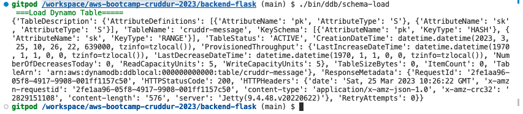
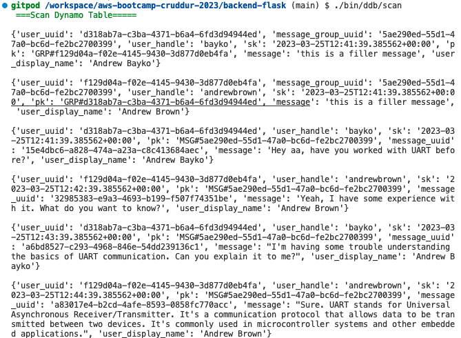
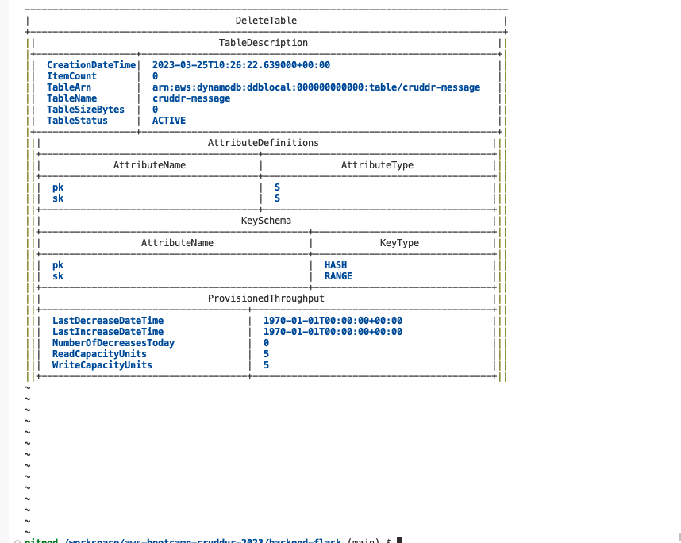

# Week 5 — DynamoDB and Serverless Caching

## **Required Homework** 

### **Scripts for DynamoDb**

Started this week by refactoring the [/backend-flask/bin](../backend-flask/bin) folder to provide the proper structure, with the new structure looking like:
```
bin
|--db
   |--connect
   |--create
   |--drop
   |--schema-load
   |--seed
   |--session
   |--setup
|--ddb
|--rds
   |--update-sg-rule
```
Afterwards, the following was done to adjust and reflect the changes from above where required:
1. In [bin/schema-load](../backend-flask/bin/db/schema-load) and [bin/seed](../backend-flask/bin/db/seed), the parent file directory is updated to reflect the current path. This done by replacing:
    ```bash
    file_parent_dir=`dirname $(dirname $(dirname $current_file_path))`
    ```

2. In [bin/setup](../backend-flask/), the following was edited:
    ```bash
    bin_db_dir=`dirname $current_file_path`

    source $bin_db_dir/drop
    source $bin_db_dir/create
    source $bin_db_dir/schema-load
    source $bin_db_dir/seed
    ```

3. In the [.gitpod.yml](../.gitpod.yml) file, the command section of postgres task was updated:
    ```yaml
        command: |
            export GITPOD_IP=$(curl ifconfig.me)
            source "$THEIA_WORKSPACE_ROOT/backend-flask/bin/rds/update-sg-rule"
    ```

4. Updated the [schema.sql](../backend-flask/db/schema.sql) and [seed.sql](../backend-flask/db/seed.sql) to include required email address.

5. Ran the following command to setup and seed thee postgres db
    ```bash
    aws-bootcamp-cruddur-2023 $ ./backend-flask/bi/db/setup

    ```


To get the dynamodb going, the following was implemented:

1. In the [requirement.txt](../backend-flask/requirements.txt), I appended ```boto3```  to the end and ran ```pip install -r requirement.txt```in the terminal.
2. Created all the required scripts in the [/backend-flask/bin/ddb](../backend-flask/bin) [/backend-flask/bin](../backend-flask/bin/ddb/) folder.
3. In some of the scripts, I had to adapt it to fit some of the other implementation done in the [lib/db.py](../backend-flask/lib/db.py).
4. Modified the [lib/db.py](../backend-flask/lib/db.py) module by adding flags to the function/method arguments list since I used the ``àpp.logger.info```. This would error out when their is no current app context.

5. Changed the permissions by running ```chmod 744 <files>```on the scripts
5. Testing was done using all the scripts written. Please see below for results:

    - Loading the Schema:

        

    - Scan of Table after seeding data:
         
    
    - Dropping Table:
         

### **Implementation of the Patterns**
This section