# **Week 6 — Deploying Containers**
This week journal would detail the steps required to have tasks run in an AWS ECS cluster with using the Fargate launch type. These tasks would be placed behind an application load balancer (ALB) and accessed via a domain name hosted on Route53. The steps below show a consolidated approach from from all the mini build up.

## **Route53, Hosted Zone, SSL Certs**
Similar to Andrew, my registered domain name (aaminu.com) lives on another aws account. To make use of the same domain name, the following steps were followed:
1. Created a new hosted zone with the same naked domain as my registered domain name. The following setting was used. 
    - Domain name: aaminu.com
    - Description: A brief description
    - Type: Public hosted zone

2. The above created two records. I opened the NS record and copied out the name servers. I updated the name servers of my original registered domain. This change propagated under 60secs

3. To ensure the domain uses TLS/SSL, a certificated was created in AWS certificate manager. The following steps are required to get a certificate:
    - In the landing page, click on request
    - Certificate type: Request a public certificate
    - In the Domain names, I add the naked domain name and two levels of wildcard subdomain. One of which is **.cruddur.aaminu.com*. The would allow me use both *api.cruddur.aaminu.com & app.cruddur.aaminu.com* with the same certificate. 
    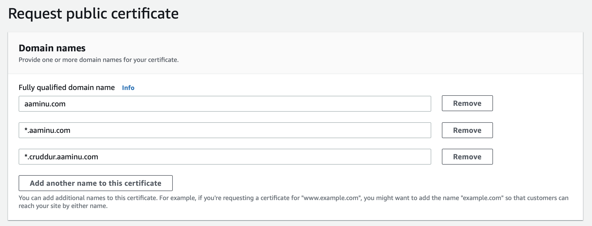
    - After clicking on created, I am redirected to the certifcated landing page. In there there's a button that allows one to created the required record in Route53, I clicked on it and created the record. This step took a while before the certificated changed to *Issued*. 
4. Back in the route53 hosted zone, one should find a CNAME record created.
5. In the application load balancer section, aliases would be created in the same hosted zone to point to the alb endpoint.
6. I export this name into my environmental variables for later use as:
```bash
export BACKEND_DOMAIN_URL="api.cruddur.aaminu.com"
gp env BACKEND_DOMAIN_URL=$BACKEND_DOMAIN_URL

export FRONTEND_DOMAIN_URL="app.cruddur.aaminu.com"
gp env FRONTEND_DOMAIN_URL=$FRONTEND_DOMAIN_URL
```


## **CloudWatch Logs Preparation**
We need to create a log group required later for task-definitions. In my case, I already had the log group, all I did was to adjust the retention policy via click-ops. To create a log group with a retention policy via CLI, the following can be used
```bash
aws logs create-log-group --log-group-name "<name>"
aws logs put-retention-policy --log-group-name "<name>" --retention-in-days <number-of-days>
```
In the process of cleaning up old logs, I realized an error in my post-confirmation-lambda. After inspecting, a fix was implemented and the affected part is shown in the screen short below:
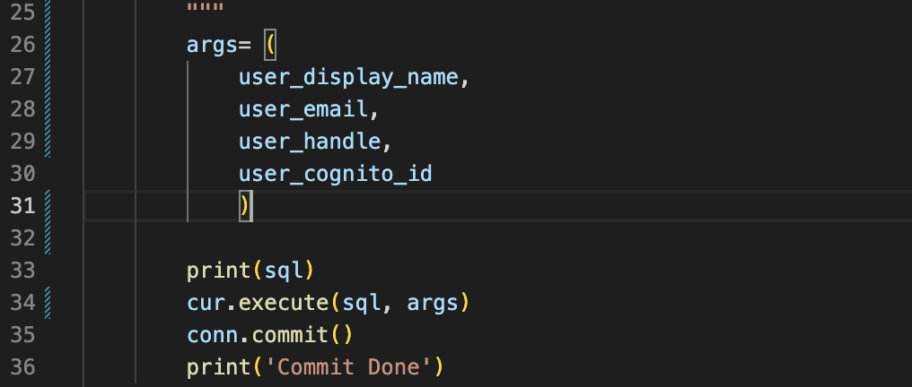


## **Application Load Balancer and Target Groups**
Since the goal is to have our ecs cluster and the services/tasks it contains sit behind a load balancer, the following was performed
1. Created a security group for the ALB. With this approach, the SG can be included in the  SG of other service's, thereby granting access:
    ```bash
    export VPC and subnet groups
    export DEFAULT_VPC_ID=$(aws ec2 describe-vpcs \
    --filters "Name=isDefault, Values=true" \
    --query "Vpcs[0].VpcId" \
    --output text)
    echo $DEFAULT_VPC_ID
    gp env DEFAULT_VPC_ID=$DEFAULT_VPC_ID

    export ALB_SG=$(aws ec2 create-security-group \
      --group-name "cruddur-alb-sg" \
      --description "Security group for ALB" \
      --vpc-id $DEFAULT_VPC_ID \
      --query "GroupId" --output text)
    
    echo $ALB_SG
    gp env ALB_SG=$ALB_SG
    ```
    Add ingress rules on port 80(Http) & 443(Https) for all sources by:

    ```bash
    aws ec2 authorize-security-group-ingress \
      --group-id $ALB_SG \
      --protocol tcp \
      --port 80 \
      --cidr 0.0.0.0/0

    aws ec2 authorize-security-group-ingress \
      --group-id $ALB_SG \
      --protocol tcp \
      --port 443 \
      --cidr 0.0.0.0/0
    ```
    One can inspect the above by navigating to EC2->Network & Security->Security Groups->cruddur-alb-sg

2. In the EC2 console page, I navigated to Target groups and created two targets group namely:
    - cruddur-backend-flask-tg. The specs of this target group are
        - Target type= IP
        - IP address type= IPV4
        - Protocol : Port = HTTP: 4567
        - Protocol version = HTTP1
        - Health check protocol = HTTP
        - Health check endpoint = /api/health-check
        - Selected the appropriate VPC and left everything else as defaults

    - cruddur-frontend-reactjs-tg. The specs of this target group are
        - Target type= IP
        - IP address type= IPV4
        - Protocol : Port = HTTP: 3000
        - Protocol version = HTTP1
        - Health check protocol = HTTP
        - Health check endpoint = /api/health-check
        - Selected the appropriate VPC and left everything else as defaults

3. Navigated to Load Balancers and created one with the following specifications:
    - Load balancer type: Application Load Balancer
    - Load balancer name: cruddur-alb
    - Scheme: Internet-facing
    - IP address type: IPV4
    - Used the default VPC and selected all the subnet available to me.
    - Selected the cruddur-alb-sg from the security group dropdown
    - Added One listener:
        - Protocol: HTTPS
        - Port: 443
        - Default action: Selected cruddur-frontend-reactjs-tg target group from the drop down
        - In the secure listener settings, selected the certificate created in ACM described in the previous chapter
    - Created the load balancer

4. Back in the load balance summary page, I selected the ALB created from above. I added an additional HTTP listener on port 80 and redirected it to HTTPS:443 with status code of *301 - Permanently moved*
    

5. I also edited the listener on port 443 to forward url paths of *api.cruddur.aaminu.com* to the cruddur-backend-flask-tg target group. The can be done as shown in the picture below:
  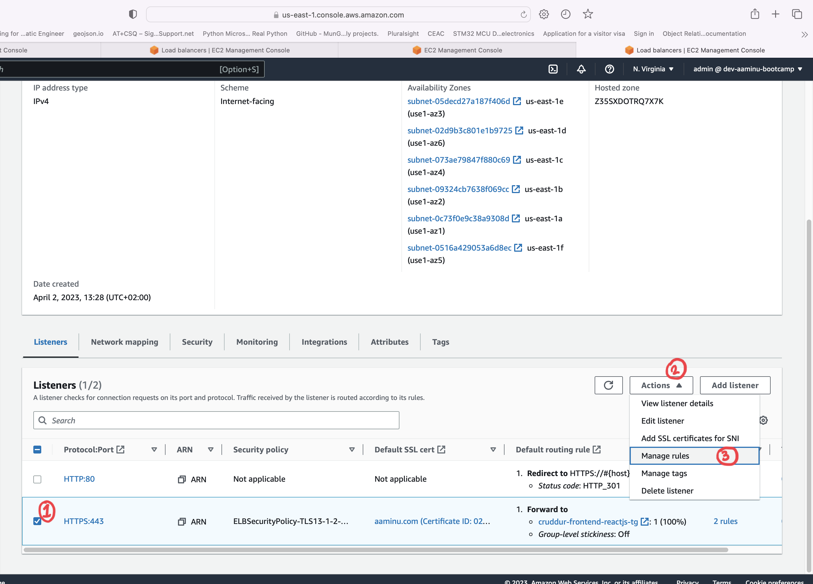
  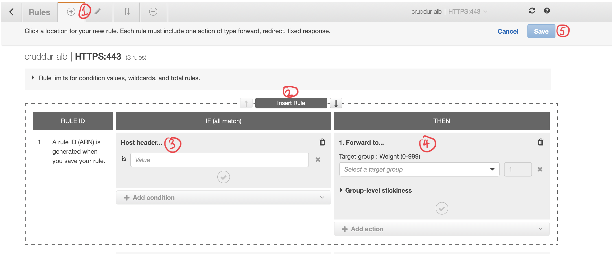
  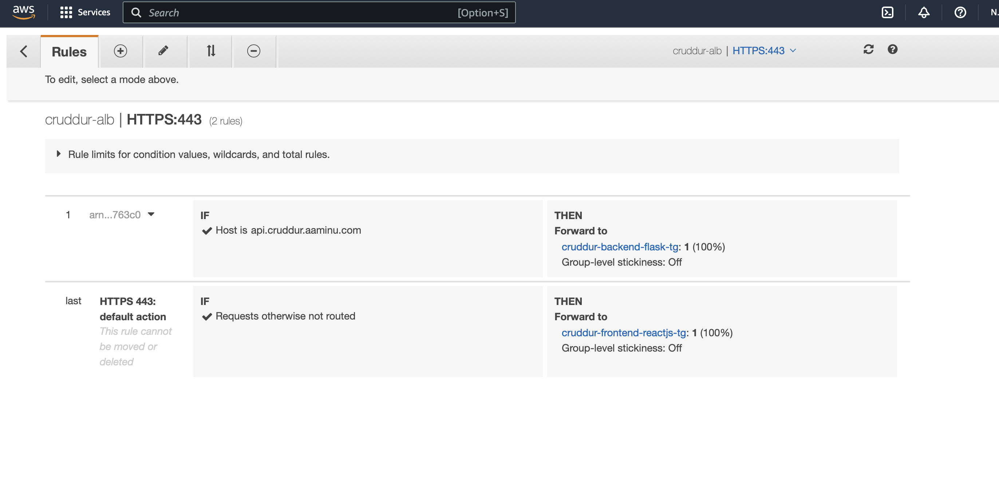

6. As a final step to have the alias pointing to the ALB, I created two record type aliases in route53 underneath the *aaminu.com* hosted zone, Both were pointed to the ALB:
  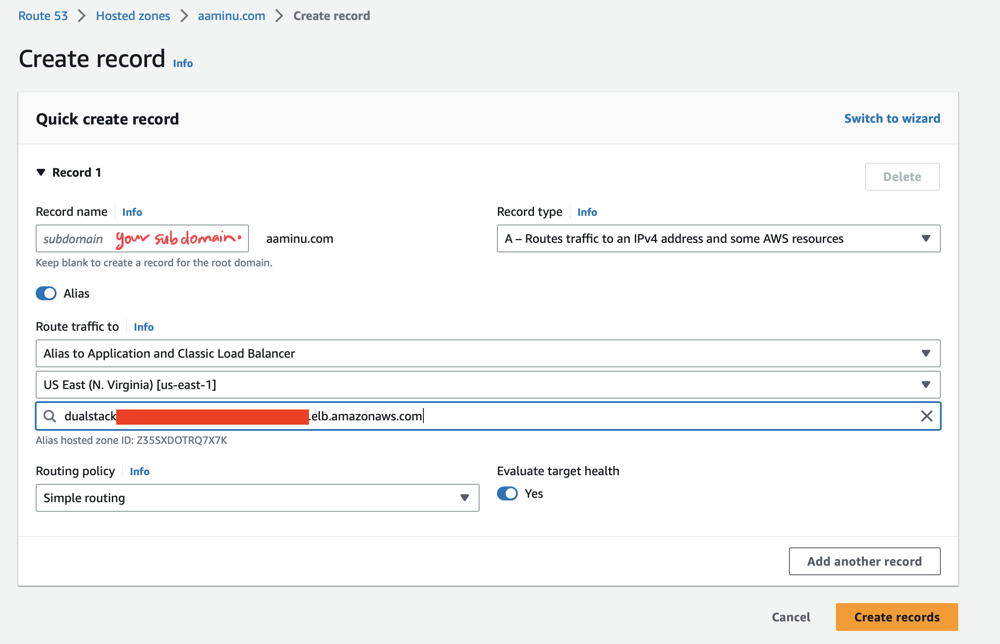
  The two aliases are depicted below:
  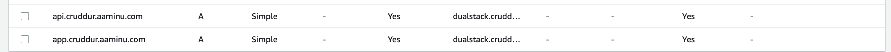
    - The *app.cruddur.aaminu.com* points to the frontend webpage
    - The *api.cruddur.aaminu.com* points to the backend api


## **Building Production FE & BE Containers, ECR Usage**
This section details the steps taken to build and push production versions of containers currently used in the development. Before getting started with pushing containers to ECR, I had to login via the CLI by:
```bash
aws ecr get-login-password --region $AWS_DEFAULT_REGION | docker login --username AWS --password-stdin "$AWS_ACCOUNT_ID.dkr.ecr.$AWS_DEFAULT_REGION.amazonaws.com"
```

### **Backend Flask Container Building** 
1. To avoid any problems one can encounter with dockerhub during builds, the base python image is pulled from dockerhub, built, tagged and pushed to own registry on ecr following the steps detailed below:
    - Made a repo to hold the image:
      ```bash
      aws ecr create-repository \
        --repository-name "cruddur-python" \
        --image-tag-mutability MUTABLE
      ```
    - Exported the url to my environment variables and persisted it my gitpod workspace:
      ```bash
      export ECR_PYTHON_URL="$AWS_ACCOUNT_ID.dkr.ecr.$AWS_DEFAULT_REGION.amazonaws.com/cruddur-python"
      gp env ECR_PYTHON_URL=$ECR_PYTHON_URL
      ```
    - I pulled the image from dockerhub, tagged it, and proceeded to push it to the ECR repo from above:
      ```bash
      docker pull python:3.10-slim-buster
      docker tag python:3.10-slim-buster $ECR_PYTHON_URL:3.10-slim-buster
      docker push $ECR_PYTHON_URL:3.10-slim-buster
      ```

2. Updated the current [Dockerfile](../backend-flask/Dockerfile) to use my python ecr image from 1. above by:
    ```docker
    ARG image_name

    FROM ${image_name}

    RUN apt-get update && apt-get install -y curl

    WORKDIR /backend-flask

    COPY requirements.txt requirements.txt
    RUN pip3 install -r requirements.txt

    COPY . .

    EXPOSE ${PORT}
    CMD [ "python3", "-m" , "flask", "run", "--host=0.0.0.0", "--port=4567", "--debug"]
    ```
3. In the [docker-compose.yml](../docker-compose.yml) file, I updated the backend task to use this image as an argument for building:
    ```yaml
    version: "3.8"
    services:
      backend-flask: 
        environment:
          # Environment variables...........
        build: 
          context: ./backend-flask
          args:
            image_name: "${ECR_PYTHON_URL}:3.10-slim-buster" # <---- ECR Image Here
        ports:
          - "4567:4567"
        volumes:
          - ./backend-flask:/backend-flask
    ```
    The above was tested using *Docker compose up*

4. In preparation of building a production docker file. The [bin](../bin/) directory was refactored out of the [backend-flask](../backend-flask/) directory.
5. In [app.py](../backend-flask/app.py), a health check endpoint was added as part of the routes:
    ```python
    @app.route('/api/health-check')
    def health_check():
        return {'success': True}, 200
    ```
6. Created a new [bin](../backend-flask/bin) directory within the [backend-flask](../backend-flask/) directory. In there, I created a [flask](../backend-flask/bin/flask/) directory and placed a script called [health-check](../backend-flask/bin/flask/health-check). This script would be used to check the health of our web-server when deployed to ECS. The content of script is shown below:
    ```bash
    #!/usr/bin/env python3

    import urllib.request

    try:
        response = urllib.request.urlopen('http://localhost:4567/api/health-check')
        if response.getcode() == 200:
            print("[Okay]: Flask server is running")
            exit(0)
        else:
            print("[Error]: Flask server is not running")
            exit(1)
    except Exception as e:
        print("[Exception]: ", e)
        exit(0)
    ```
    I modified the permissions to this script by ```chmod 744 backend-flask/bin/flask/health-check ``` in the terminal.
7. Next was to create the [Dockerfile.prod](../backend-flask/Dockerfile.prod) which disables debugging and logging. The contents is shown below:

    ```docker
      ARG image_name

      FROM ${image_name}

      RUN apt-get update && apt-get install -y curl

      WORKDIR /backend-flask

      COPY requirements.txt requirements.txt
      RUN pip3 install -r requirements.txt

      COPY . .

      EXPOSE ${PORT}
      CMD [ "python3", "-m" , "flask", "run", "--host=0.0.0.0", "--port=4567", "--no-debug", "--no-debugger", "--no-reload"]
      ```
8. I built the dockerfile from above, tagged and pushed it to its own repo. Part of the commands shown below created a repo for the backend-flask image:
    ```bash
    aws ecr create-repository \
      --repository-name backend-flask \
      --image-tag-mutability MUTABLE

    export ECR_BACKEND_FLASK_URL="$AWS_ACCOUNT_ID.dkr.ecr.$AWS_DEFAULT_REGION.amazonaws.com/backend-flask"
    gp env ECR_BACKEND_FLASK_URL=$ECR_BACKEND_FLASK_URL

    cd backend-flask/
    docker build -t backend-flask --build-arg image_name=$ECR_PYTHON_URL:3.10-slim-buster -f "Dockerfile.prod" .
    docker tag backend-flask:latest $ECR_BACKEND_FLASK_URL:latest
    docker push $ECR_BACKEND_FLASK_URL:latest 
    ```

### **Frontend React-JS Container Building** 
1. First stop was to navigate to the [/frontend-react-js](../frontend-react-js/) directory and create a [Dockerfile.prod](../frontend-react-js/Dockerfile.prod) file with content:
    ```docker
    # Base Image ~~~~~~~~~~~~~~~~~~~~~~~~~~~~~~~~~~
    FROM node:16.18 AS build

    ARG REACT_APP_BACKEND_URL
    ARG REACT_APP_AWS_PROJECT_REGION
    ARG REACT_APP_AWS_COGNITO_REGION
    ARG REACT_APP_AWS_USER_POOLS_ID
    ARG REACT_APP_CLIENT_ID

    ENV REACT_APP_BACKEND_URL=$REACT_APP_BACKEND_URL
    ENV REACT_APP_AWS_PROJECT_REGION=$REACT_APP_AWS_PROJECT_REGION
    ENV REACT_APP_AWS_COGNITO_REGION=$REACT_APP_AWS_COGNITO_REGION
    ENV REACT_APP_AWS_USER_POOLS_ID=$REACT_APP_AWS_USER_POOLS_ID
    ENV REACT_APP_CLIENT_ID=$REACT_APP_CLIENT_ID

    COPY . ./frontend-react-js
    WORKDIR /frontend-react-js
    RUN npm install
    RUN npm run build

    # New Base Image ~~~~~~~~~~~~~~~~~~~~~~~~~~~~~~
    FROM nginx:1.23.3-alpine

    # --from build is coming from the Base Image
    COPY --from=build /frontend-react-js/build /usr/share/nginx/html
    COPY --from=build /frontend-react-js/nginx.conf /etc/nginx/nginx.conf

    EXPOSE 3000
    ```
2. In the same direction, I created a [nginx.conf](../frontend-react-js/nginx.conf) configuration file. Please file for contents.

3. I had to also create a repo in ECR that'll hold the frontend image and also exported the url to my env variables:
    ```bash
    aws ecr create-repository \
      --repository-name frontend-react-js \
      --image-tag-mutability MUTABLE

    export ECR_FRONTEND_REACT_URL="$AWS_ACCOUNT_ID.dkr.ecr.$AWS_DEFAULT_REGION.amazonaws.com/frontend-react-js"

    gp env ECR_FRONTEND_REACT_URL=$ECR_FRONTEND_REACT_URL
    ```
4. While still in the frontend [/frontend-react-js](../frontend-react-js/) directory, I built the image by:
    ```bash
    docker build \
    --build-arg REACT_APP_BACKEND_URL="https://$BACKEND_DOMAIN_URL" \
    --build-arg REACT_APP_AWS_PROJECT_REGION="$AWS_DEFAULT_REGION" \
    --build-arg REACT_APP_AWS_COGNITO_REGION="$AWS_DEFAULT_REGION" \
    --build-arg REACT_APP_AWS_USER_POOLS_ID="$AWS_USER_POOLS_ID" \
    --build-arg REACT_APP_CLIENT_ID="$COGNITO_APP_CLIENT_ID" \
    -t frontend-react-js \
    -f Dockerfile.prod .
    ```
5. Image was tagged and pushed:
    ```bash
    docker tag frontend-react-js:latest $ECR_FRONTEND_REACT_URL:latest
    docker push $ECR_FRONTEND_REACT_URL:latest
    ```


## **ECS - Cluster, Service & Task**
Elastic container service is a fully managed container orchestration service that simplifies your deployment, management, and scaling of containerized applications. The Fargate launch type is used for this project and the setup is described below:

1. I set up a cluster that'll contain the service/tasks intended in the ecs via the cli by running:
    ```bash
    aws ecs create-cluster \
    --cluster-name cruddur \
    --service-connect-defaults namespace=cruddur
    ```
2. Before proceeding, I setup IAM roles which will be used by the service and task. This role would have policies attached to them and allow the service/task access different resource with my aws account:
    - Created a [service-assume-role-execution-policy.json](../aws/policies/service-assume-role-execution-policy.json) file with content:
      ```json
      {
          "Version":"2012-10-17",
          "Statement":
          [
              {
                  "Action":["sts:AssumeRole"],
                  "Effect":"Allow",
                  "Principal":{
                  "Service":["ecs-tasks.amazonaws.com"]
                  }
              }
          ]
      }
      ```
    - Then executed the file from above to create the role by:
        ```bash
        aws iam create-role \    
        --role-name CruddurServiceExecutionRole  \   
        --assume-role-policy-document file://aws/policies/service-assume-role-execution-policy.json
        ```
    - The policies to be attached to the role above are contained within [service-execution-policy.json](../aws/policies/service-execution-policy.json) and was attached to the role by:
      ```bash
      aws iam put-role-policy \
      --policy-name CruddurServiceExecutionPolicy \
      --role-name CruddurServiceExecutionRole \
      --policy-document file://aws/policies/service-execution-policy.json
      ```
    - The role required by Tasks that'll run in the cluster is contained in [task-assume-role-execution-policy.json](../aws/policies/task-assume-role-execution-policy.json) file shown below and it was created in the IAM space by :
        ```json
        {
          "Version":"2012-10-17",
          "Statement":
          [
            {
              "Action":["sts:AssumeRole"],
              "Effect":"Allow",
              "Principal":{
              "Service":["ecs-tasks.amazonaws.com"]
              }
            }
          ]
        }
        ```
        
        ```bash
        - Create a role 
        aws iam create-role \
        --role-name CruddurTaskRole \
        --assume-role-policy-document file://aws/policies/task-assume-role-execution-policy.json
        ```
    - The policies to be attached to the role above are contained within [task-execution-policy.json](../aws/policies/task-execution-policy.json) and was attached to the role by:
        ```bash
        aws iam put-role-policy \
        --policy-name CruddurTaskPolicy \
        --role-name CruddurTaskRole \
        --policy-document file://aws/policies/task-execution-policy.json
        ```
    - I also attached some aws managed policies e.g. Cloudwatch, Xray etc. to the task role by:
        ```bash
        aws iam attach-role-policy --policy-arn arn:aws:iam::aws:policy/CloudWatchFullAccess --role-name CruddurTaskRole

        aws iam attach-role-policy --policy-arn arn:aws:iam::aws:policy/AWSXRayDaemonWriteAccess --role-name CruddurTaskRole
        ```

3. Before proceeding to task definitions and services definitions, I created a new security group, export subnets details to my environment variables:
    ```bash
    export DEFAULT_SUBNET_IDS=$(aws ec2 describe-subnets  \
    --filters Name=vpc-id,Values=$DEFAULT_VPC_ID \
    --query 'Subnets[*].SubnetId' \
    --output json | jq -r 'join(",")')
    echo $DEFAULT_SUBNET_IDS

    export CRUD_SERVICE_SG=$(aws ec2 create-security-group \
      --group-name "crud-srv-sg" \
      --description "Security group for Cruddur services on ECS" \
      --vpc-id $DEFAULT_VPC_ID \
      --query "GroupId" --output text)
    echo $CRUD_SERVICE_SG
    gp env CRUD_SERVICE_SG=$CRUD_SERVICE_SG
    ```
    I also added inbound rules for the new security group:
    ```bash
    aws ec2 authorize-security-group-ingress \
    --group-id $CRUD_SERVICE_SG \
    --protocol tcp \
    --port 80 \
    --cidr 0.0.0.0/0

    aws ec2 authorize-security-group-ingress \
    --group-id $CRUD_SERVICE_SG \
    --protocol tcp \
    --port 443 \
    --cidr 0.0.0.0/0
    ```
4. I created task definitions in json files for both frontend and backend. This files are called 
[backend-flask.json](../aws/task-definitions/backend-flask.json) and [frontend-react-js.json](../aws/task-definitions/frontend-react-js.json). Inspecting the [backend-flask.json](../aws/task-definitions/backend-flask.json) file, one would notice that it expect some secret to be saved in AWS system manager parameter store.

5. To meet with the requirement from above, I set the required secrets in parameter store by:
    ```bash
    aws ssm put-parameter --type "SecureString" --name "/cruddur/backend-flask/AWS_ACCESS_KEY_ID" --value $AWS_ACCESS_KEY_ID
    aws ssm put-parameter --type "SecureString" --name "/cruddur/backend-flask/AWS_SECRET_ACCESS_KEY" --value $AWS_SECRET_ACCESS_KEY
    aws ssm put-parameter --type "SecureString" --name "/cruddur/backend-flask/CONNECTION_URL" --value $PROD_CONNECTION_URL
    aws ssm put-parameter --type "SecureString" --name "/cruddur/backend-flask/ROLLBAR_ACCESS_TOKEN" --value $ROLLBAR_ACCESS_TOKEN
    aws ssm put-parameter --type "SecureString" --name "/cruddur/backend-flask/OTEL_EXPORTER_OTLP_HEADERS" --value "x-honeycomb-team=$HONEYCOMB_API_KEY"
    ```
6. I then proceeded to create the json services files for both frontend and backend that'll house the task defined by the task-definition from above. Two json files ([service-backend-flask.json](../aws/json/service-backend-flask.json) & [service-frontend-react-js.json](../aws/json/service-frontend-react-js.json)) contain the service configurations e.g security group, subnets, ALB target group, launch type. 
7. Before deploying the json files from above to ecs, I updated the security group used by the RDS to allow ingress traffic from the security group of the ECS cluster on the required port. Please image below:
  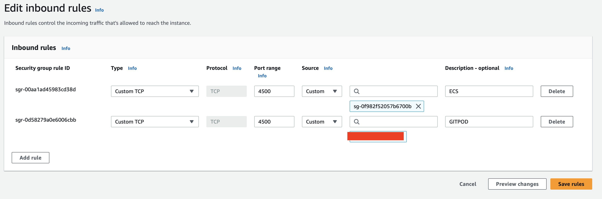

8. I uploaded the task-definitions to the ecs cluster by: 
    ```bash
    aws ecs register-task-definition --cli-input-json file://aws/task-definitions/backend-flask.json

    aws ecs register-task-definition --cli-input-json file://aws/task-definitions/frontend-react-js.json
    ```
9. Next was to start up the frontend and backend services by executing the following:
    ```bash
    aws ecs create-service --cli-input-json file://aws/json/service-backend-flask.json
    aws ecs create-service --cli-input-json file://aws/json/service-frontend-react-js.json
    ````
10. After a short while and Inspecting the cluster on ECS, everything seems to be running just fine. Please see images below:

    Services Running
      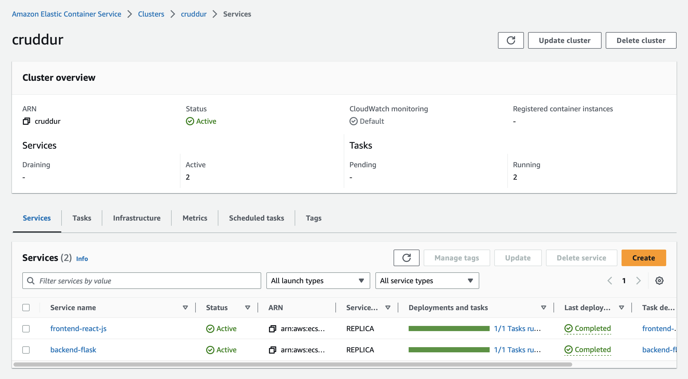

    Frontend Tasks
    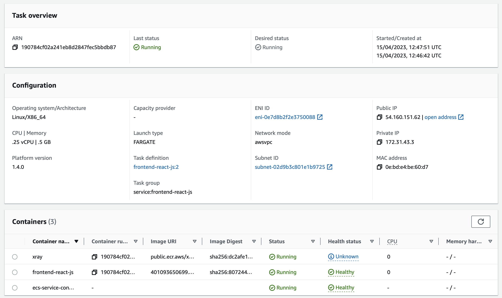

    Backend Tasks
    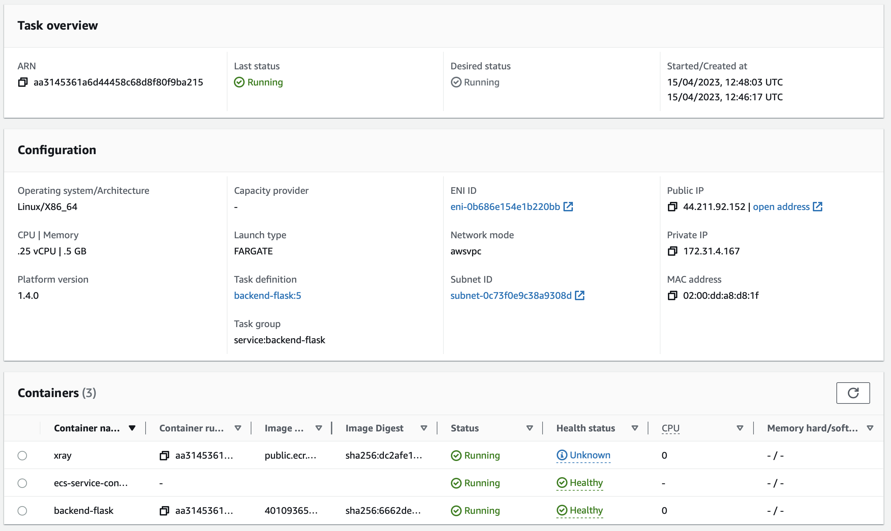

11. Inspecting the subdomain *app.cruddur.aaminu.com*:
    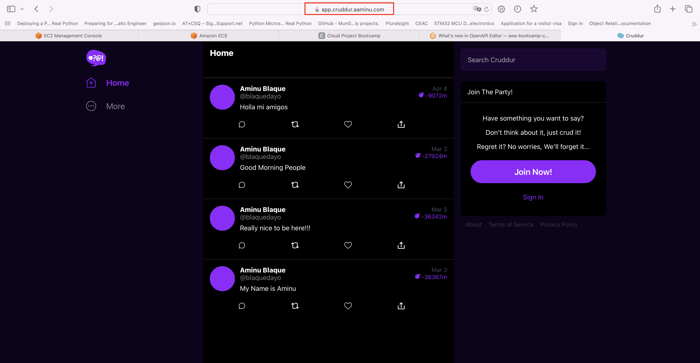


## **Other Tasks**
### **Implement Refresh Token for Amazon Cognito**
1. I updated the content of [CheckAuth.js](../frontend-react-js/src/lib/CheckAuth.js) contained in the frontend-react-js folder with the following:
    ```js
    import { Auth } from 'aws-amplify';

    export async function checkAuth (setUser){
      Auth.currentAuthenticatedUser({
        // Optional, By default is false. 
        // If set to true, this call will send a 
        // request to Cognito to get the latest user data
        bypassCache: false 
      })
      .then((cognito_user) => {
        // console.log('cognito_user', cognito_user);
        setUser({
          display_name: cognito_user.attributes.name,
          handle: cognito_user.attributes.preferred_username
        })
        return Auth.currentSession()
      })
      .then((cognito_user_session) => {
        // console.log('cognito_user_session',cognito_user_session);
        localStorage.setItem("access_token", cognito_user_session.accessToken.jwtToken)
        
      })
      .catch((err) => console.log(err));
    };


    export async function getAccessToken(){
      Auth.currentSession()
      .then((cognito_user_session) => {
        // console.log('cognito_user_session',cognito_user_session);
        localStorage.setItem("access_token", cognito_user_session.accessToken.jwtToken)
        
      })
      .catch((err) => console.log(err));
    }
    ```
2. I updated all location where a call to to the backend API is made by replacing it with the following:
    ```js
    //Add this import to the import group
    import { checkAuth, getAccessToken } from '../lib/CheckAuth';

    //Add this to the async function making the call
    const loadData = async () => {
        try {
          //..... Other part of function
          
          await getAccessToken();
          const access_token = localStorage.getItem("access_token");
          const res = await fetch(backend_url, {
            headers: {
              Authorization: `Bearer ${access_token}`
            },
            method: "GET"
          });

          //..... Other part of function
          
        } catch (err) {
          console.log(err);
        }
      };
    ```
3. Rebuilt and pushed the frontend prod image as described [here](#frontend-react-js-container-building)


### **Refactor bin directory to be top level**
To achieve this, the following was done:
- Move bin directory out of backend folderr into the main project directory
- modify the paths in the scripts to reflect current paths
- Group ECS scripts into backend and frontend folder  for ease of use.
Please refer to [/bin](../bin/) directory for more information.


###  **Using ruby generate out env dot files for docker using erb templates**
1. I created a folder called [erb](../erb) in the project directory and added two .erb files [backend-flask.env.erb](../erb/backend-flask.env.erb) & [frontend-react-js.env.erb](../erb/frontend-react-js.env.erb). These are the files that would be fleshed out to produce .env file
2. In my [/bin/backend/](../bin/backend/) and [/bin/frontend/](../bin/frontend/) directory, scripts called [generate-env](../bin/backend/generate-env)(backend) & [generate-env](../bin/frontend/generate-env)(frontend) were created with contents:
    
    Backend:
    ```bash
    #!/usr/bin/env ruby

    require 'erb'

    template = File.read 'erb/backend-flask.env.erb'
    content = ERB.new(template).result(binding)
    filename = "backend-flask.env"
    File.write(filename, content)
    ```
    Frontend
    ```bash
    #!/usr/bin/env ruby

    require 'erb'

    template = File.read 'erb/frontend-react-js.env.erb'
    content = ERB.new(template).result(binding)
    filename = "frontend-react-js.env"
    File.write(filename, content)
    ```
3. Changed the execution permission by using ```chmod 744 generate-env```in the respective folder
4. Updated [.gitpod.yml](../.gitpod.yml) to auto generate upon launch of the workspace
    ```yaml
    tasks:
    - name: npm-init
      command: |
        source  "$THEIA_WORKSPACE_ROOT/bin/frontend/generate-env"  #<----Here
        cd "$THEIA_WORKSPACE_ROOT/frontend-react-js"
        npm i --save \
          @opentelemetry/api \
          @opentelemetry/sdk-trace-web \
          @opentelemetry/exporter-trace-otlp-http \
          @opentelemetry/instrumentation-document-load \
          @opentelemetry/context-zone \
          aws-amplify
      
    - name: flask
      command: |
        source  "$THEIA_WORKSPACE_ROOT/bin/backend/generate-env" #<----Here
        cd "$THEIA_WORKSPACE_ROOT/backend-flask/"
        pip install -r requirements.txt
    ```
5. Finally added the generated .env file into the [docker-compose.yml](../docker-compose.yml) file 
    ```yaml
    version: "3.8"
    services:
      backend-flask: 
        env_file:
          - backend-flask.env  # <-------------Here
        build: 
          context: ./backend-flask
          args:
            image_name: "${ECR_PYTHON_URL}:3.10-slim-buster"
        ports:
          - "4567:4567"
        volumes:
          - ./backend-flask:/backend-flask
        
      frontend-react-js:
        env_file:
          - frontend-react-js.env   # <-------------Here
        build: 
          context: ./frontend-react-js
    # ..............
    ```


### **Change Docker Compose to explicitly use a user-defined network**

In the [dockerr-compose.yml](../docker-compose.yml) file, the following changes were made
  ```yaml
  version: "3.8"
  services:
    backend-flask: 
      #..........
      networks: #<--------------Added to each task
        - cruddur-net
      
      
    frontend-react-js:
      #..........
      networks:  # <-------------Here
        - cruddur-net
      
    otel-collector:
      #..........
      networks:   # <-------------Here
        - cruddur-net

    xray-daemon:
      image: "amazon/aws-xray-daemon"
      environment:
        AWS_ACCESS_KEY_ID: "${AWS_ACCESS_KEY_ID}"
        AWS_SECRET_ACCESS_KEY: "${AWS_SECRET_ACCESS_KEY}"
        AWS_REGION: "us-east-1"
      command:
        - "xray -o -b xray-daemon:2000"
      ports:
        - 2000:2000/udp
      networks:
        - cruddur-net

    dynamodb-local:
      #................
      networks: # <-------------Here
        - cruddur-net

    db:
      #..............
      networks:  # <-------------Here
        - cruddur-net

  networks:  # New user defined network
    cruddur-net:
      driver: bridge
      name: cruddur-net

  volumes:
    db:
      driver: local

  ```