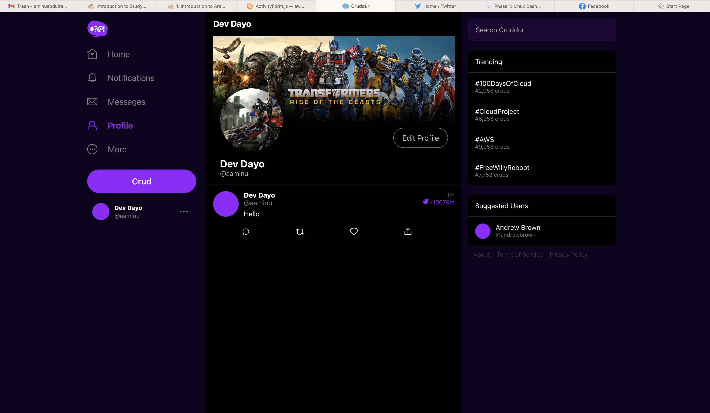

# Week 8 — Serverless Image Processing

This week details the use of CDK to architect and deploy a serverless avatar image processing pipeline, implementation of the profile page, serving of the processed avatar via cloudfront, 

## **CDK Stack**
The CDK stack is used for provisioning the serverless-avatar-image processing task. The diagram below illustrates the task and how the it was architected: 


To get started with using CDK for this stack the following were done:
1. In the project directory, I made a new folder([thumbing-serverless-cdk/](../thumbing-serverless-cdk/)) for the cdk stack:
    ```bash
    mkdir thumbing-serverless-cdk
    cd thumbing-serverless-cdk
    ```
2. Installed the cdk:
    ```bash
    npm install aws-cdk -g
    ```
3. Initialize the cdk in the recently created directory by:
    ```bash
    cdk init app --language typescript
4. I logged unto aws console and create a s3 bucket called *aaminu-cruddur-uploaded-avatars* with all the default setting enabled. The bucket name is unique to me.
5. In the same [thumbing-serverless-cdk/](../thumbing-serverless-cdk/) directory, I created a *[.env.example](../thumbing-serverless-cdk/.env.example)* config file with content:
    ```.env
    UPLOADS_BUCKET_NAME="aaminu-cruddur-uploaded-avatars"
    ASSETS_BUCKET_NAME="assets.cruddur.aaminu.com"
    THUMBING_FUNCTION_PATH="/workspace/aws-bootcamp-cruddur-2023/aws/lambdas/process-images"
    THUMBING_S3_FOLDER_OUTPUT="avatars"
    THUMBING_WEBHOOK_URL="https://api.cruddur.aaminu.com/webhooks/avatar"
    THUMBING_TOPIC_NAME="cruddur-assets"
    ```
6. I created a *.env* file from the above by simply doing a:
    ```bash
    cp .env.example .env
    ````
7. I created a lambda directory [aws/lambdas/process-images](../aws/lambdas/process-images/) meant to contain the function handler and all required node module for the lambda on aws. I navigated to the folder in the terminal and installed the required node modules by:
    ```bash
    npm i sharp
    npm i @aws-sdk/client-s3
    ````
8. I copied all the provided avatar processing code to [aws/lambdas/process-images](../aws/lambdas/process-images/) directory
9. Back in the [thumbing-serverless-cdk/lib](../thumbing-serverless-cdk/lib) directory, the following code setup the stack required for the serverless image processing:
    ```typescript
    import * as cdk from 'aws-cdk-lib';
    import { Construct } from 'constructs';
    // import * as sqs from 'aws-cdk-lib/aws-sqs';
    import * as iam from 'aws-cdk-lib/aws-iam';
    import * as s3 from 'aws-cdk-lib/aws-s3';
    import * as lambda from 'aws-cdk-lib/aws-lambda';
    import * as s3n from 'aws-cdk-lib/aws-s3-notifications';
    import * as subscriptions from 'aws-cdk-lib/aws-sns-subscriptions';
    import * as sns from 'aws-cdk-lib/aws-sns';
    import * as dotenv from 'dotenv';

    dotenv.config();


    export class ThumbingServerlessCdkStack extends cdk.Stack {
    constructor(scope: Construct, id: string, props?: cdk.StackProps) {
        super(scope, id, props);

        //The code that defines your stack goes here
        const uploadsBucketName: string = process.env.UPLOADS_BUCKET_NAME as string;
        const assetsBucketName: string = process.env.ASSETS_BUCKET_NAME as string;
        //const folderInput: string = process.env.THUMBING_S3_FOLDER_INPUT as string;
        const folderOutput: string = process.env.THUMBING_S3_FOLDER_OUTPUT as string;
        const webhookUrl: string = process.env.THUMBING_WEBHOOK_URL as string;
        const topicName: string = process.env.THUMBING_TOPIC_NAME as string;
        const functionPath: string = process.env.THUMBING_FUNCTION_PATH as string;
        console.log('uploadsBucketName', uploadsBucketName)
        console.log('assetsBucketName',assetsBucketName)
        //console.log('folderInput',folderInput)
        console.log('folderOutput',folderOutput)
        console.log('webhookUrl',webhookUrl)
        console.log('topicName',topicName)
        console.log('functionPath',functionPath)

        const uploadsBucket = this.createBucket(uploadsBucketName)
        const assetsBucket = this.importBucket(assetsBucketName);
        const lambda = this.createLambda(functionPath, uploadsBucketName, assetsBucketName, folderOutput);
        const snsTopic = this.createSnsTopic(topicName)
        
        this.createSnsSubscription(snsTopic,webhookUrl)

        //s3 Notifications
        this.createS3NotifyToLambda(lambda, uploadsBucket);
        this.createS3NotifyToSns(folderOutput, snsTopic, assetsBucket);

        //Lambda s3 policy
        const s3UploadsReadWritePolicy = this.createPolicyBucketAccess(uploadsBucket.bucketArn);
        const s3AssetsReadWritePolicy = this.createPolicyBucketAccess(assetsBucket.bucketArn);
        lambda.addToRolePolicy(s3UploadsReadWritePolicy);
        lambda.addToRolePolicy(s3AssetsReadWritePolicy);
           
    }

    // Creates a new s3 bucket
    createBucket(bucketName: string): s3.IBucket {
        const bucket = new s3.Bucket(this, 'UploadsBucket', {
        bucketName: bucketName,
        removalPolicy: cdk.RemovalPolicy.DESTROY 
        });
        return bucket;
    }

    // Imports an existing bucket
    importBucket(bucketName: string): s3.IBucket {
        const bucket = s3.Bucket.fromBucketName(this, 'AssetBucket', bucketName );
        return bucket;
    }

    //Creates a get and put object permission 
    createPolicyBucketAccess(bucketArn: string){
        const s3ReadWritePolicy = new iam.PolicyStatement({
        actions: [
            's3:GetObject',
            's3:PutObject',
        ],
        resources: [
            `${bucketArn}/*`,
        ]
        });
        return s3ReadWritePolicy;
    }

    // creates a new lambda 
    createLambda(functionPath: string, uploadsBucketName: string, assetsBucketName: string, folderOutput: string): lambda.IFunction {
        const lambdaFunction = new lambda.Function(this, 'ThumbLambda', {
        runtime: lambda.Runtime.NODEJS_18_X,
        handler: 'index.handler',
        code: lambda.Code.fromAsset(functionPath),
        environment: {
            DEST_BUCKET_NAME: assetsBucketName,
            FOLDER_OUTPUT: folderOutput,
            PROCESS_WIDTH: '512',
            PROCESS_HEIGHT: '512'
        }
        });
        return lambdaFunction;
    } 

    // S3 Notification to Lambda
    createS3NotifyToLambda( lambda: lambda.IFunction, bucket: s3.IBucket): void {
        const destination = new s3n.LambdaDestination(lambda);
        bucket.addEventNotification(
        s3.EventType.OBJECT_CREATED_PUT,
        destination
        )
    }

    //Create SNS Topic
    createSnsTopic(topicName: string): sns.ITopic{
        const logicalName = "ThumbingTopic";
        const snsTopic = new sns.Topic(this, logicalName, {
        topicName: topicName
        });
        return snsTopic;
    }

    //Create SNS subscription
    createSnsSubscription(snsTopic: sns.ITopic, webhookUrl: string): sns.Subscription {
        const snsSubscription = snsTopic.addSubscription(
        new subscriptions.UrlSubscription(webhookUrl)
        )
        return snsSubscription;
    }

     // S3 Notification to SNS
    createS3NotifyToSns(prefix: string, snsTopic: sns.ITopic, bucket: s3.IBucket): void {
        const destination = new s3n.SnsDestination(snsTopic)
        bucket.addEventNotification(
        s3.EventType.OBJECT_CREATED_PUT, 
        destination,
        {prefix: prefix}
        );
    }

    createPolicySnSPublish(topicArn: string){
        const snsPublishPolicy = new iam.PolicyStatement({
        actions: [
            'sns:Publish',
        ],
        resources: [
            topicArn
        ]
        });
        return snsPublishPolicy;
    }
        
    }
    ```

10. I ran the following two commands. The first bootstraps the cdk for aws permission, while the second deploys the stack to cloudformation.
    ```bash
    cdk bootstrap "aws://$AWS_ACCOUNT_ID/$AWS_DEFAULT_REGION"
    cdk deploy
    ```
11. The deployed stack was inspected in cloudformation stack by selecting the region provided to the bootstrap command. The image below shows the deployed stack:
    

12. I tested the serverless avatar pipeline by uploading a mock image using the terminal
    ```bash
    aws s3 cp mock.jpg "s3://aaminu-cruddur-uploaded-avatars" 
    ```
    The image was processed and sent to my assets.cruddur.aaminu.com under the avatars/ folder.
13. To ensure proper setup of environment, I also adder the following command to [.gitpod.yml](../.gitpod.yml) config file:
    ```yaml
    - name: cdk
    before: |
      npm install aws-cdk -g
      cd "$THEIA_WORKSPACE_ROOT/thumbing-serverless-cdk"
      cp .env.example .env
      npm i
      cdk bootstrap "aws://$AWS_ACCOUNT_ID/$AWS_DEFAULT_REGION"
      cd "$THEIA_WORKSPACE_ROOT/aws/lambdas/process-images"
      npm i
    ```
## **Serve Avatars via CloudFront**
I setup a cloudfront for serving assets using click-ops. To begin, I navigated to the cloudfront service console and clicked on ***Create distribution***. The following was settings were used for the distribution.
1. Origin
    - Origin domain: Amazon S3; Asset bucket
    - Origin access: Origin access control settings (recommended)
    - Enable Origin Shield: No
2. Default cache behavior:
    - Viewer protocol policy: Redirect HTTP to HTTPS
    - Cache key and origin requests: Cache policy and origin request policy (recommended)
        -  Cache policy: CachingOptimized
        - Origin request policy - optional: CORS-CustomOrigin
        - Response headers policy - optional: SimpleCORS
3. Settings:
    - Custom SSL certificate - optional: I chose my ACM certificate since it was already in us-east-1.
4. Every other settings not mentioned above we left at the default definition/selection.

After creating distribution, I updated the policy for the s3 bucket by:
1. I clicked on the new distribution. 
2. In there, I selected Origin -> the radio button next to the origin -> Edit -> Copy Policy. 
3. Then I headed to the S3 bucket pointed by cloudfront distribution, pasted in the policy, and saved the new policy

Finally, In my *aaminu.com* hosted zone currently on Route 53, I created a new alias that points to the cloudfront distribution. The alias is *assets.cruddur.aaminu.com*.

The image below is rendered from my cloudfront:


## **Presigned URL generation via Ruby Lambda & JWT Lambda Layer**
### Lambda Layer
Before Creating the final Presigned URL, I had to create a JWT lambda layer that doesn't get bundled with the default ruby runtime
1. In the [/bin](../bin/) directory, I created a new folder called [/bin/lambda-layers](../bin/lambda-layers/), and in there a [ruby-jwt](../bin/lambda-layers/ruby-jwt) script
2. Changed the permission of the file by ```chmod 744 ruby-jwt```
3. The content of the file is given as:
    ```bash
    #! /usr/bin/bash

    gem i jwt -Ni /tmp/lambda-layers/ruby-jwt/ruby/gems/2.7.0
    cd /tmp/lambda-layers/ruby-jwt

    zip -r lambda-layers . -x ".*" -x "*/.*"
    zipinfo -t lambda-layers

    aws lambda publish-layer-version \
    --layer-name jwt \
    --description "Lambda Layer for JWT" \
    --license-info "MIT" \
    --zip-file fileb://lambda-layers.zip \
    --compatible-runtimes ruby2.7 
    ````
4. Ran the script in the terminal.

### Lambda Console
Back in the Lambda console, I created a new lambda with the following settings:
1. Basic information
    - Function name: CruddurUploadAvatar
    - Runtime: Ruby 2.7
2. After creation, I selected the lambda lambda and made the following changes
    - Code
        - Code source:
        ```ruby
        require 'aws-sdk-s3'
        require 'json'
        require 'jwt'

        def handler(event:, context:)
            puts event
            # return cors headers for preflight check
            if event['routeKey'] == "OPTIONS /{proxy+}"
                puts({step: 'preflight', message: 'preflight CORS check'}.to_json)
                { 
                headers: {
                    "Access-Control-Allow-Headers": "*, Authorization",
                    "Access-Control-Allow-Origin": ENV["ORIGIN_URL"],
                    "Access-Control-Allow-Methods": "OPTIONS,GET,POST"
                },
                statusCode: 200
                }
            else
                token = event['headers']['authorization'].split(' ')[1]
                puts({step: 'presignedurl', access_token: token}.to_json)

                body_hash = JSON.parse(event["body"])
                extension = body_hash["extension"]

                decoded_token = JWT.decode token, nil, false
                cognito_user_uuid = decoded_token[0]['sub']

                s3 = Aws::S3::Resource.new
                bucket_name = ENV["UPLOADS_BUCKET_NAME"]
                object_key = "#{cognito_user_uuid}.#{extension}"

                puts({object_key: object_key}.to_json)

                obj = s3.bucket(bucket_name).object(object_key)
                url = obj.presigned_url(:put, expires_in: 60 * 5)
                url # this is the data that will be returned
                body = {url: url}.to_json
                { 
                headers: {
                    "Access-Control-Allow-Headers": "*, Authorization",
                    "Access-Control-Allow-Origin": ENV["ORIGIN_URL"],
                    "Access-Control-Allow-Methods": "OPTIONS,GET,POST"
                },
                statusCode: 200, 
                body: body 
                }
            end # if 
        end # def handler
        ```
        - Runtime settings: edited the handler to *function.handler*

        - Layers: Add a layer -> Custom layers -> Custom layers Selection (jwt) -> verison(1) -> Add
    - Configuration
        - Environment variables:
            - ORIGIN_URL
            - UPLOADS_BUCKET_NAME

        - Permissions:
            - Execution Role: I added a inline policy that grants *Allow: s3:PutObject* permission
                ```json
                {
                    "Version": "2012-10-17",
                    "Statement": [
                        {
                            "Sid": "VisualEditor0",
                            "Effect": "Allow",
                            "Action": "s3:PutObject",
                            "Resource": "arn:aws:s3:::aaminu-cruddur-uploaded-avatars/*"
                        }
                    ]
                }
                ```
                This permission can also be found in the saved policy json file [aws/policies/s3-upload-avatar-presigned-url-policy.json](../aws/policies/s3-upload-avatar-presigned-url-policy.json).

### Local Testing
To allow for testing locally, the lambda layer was created in the [aws/lambdas/cruddur-upload-avatar/](../aws/lambdas/cruddur-upload-avatar/) directory:
1. In the folder above, a file called [test.rb](../aws/lambdas/cruddur-upload-avatar/test.rb) with the a stripped down code as [here](#lambda-console) is used to test to only the basic presigned url functionality.
2. In the terminal while in the current lambda directory, I ran ```bundle init```
3. In the resulting [Gemfile](../aws/lambdas/cruddur-upload-avatar/Gemfile), I appended the following:
    ```Gemfile
    gem "aws-sdk-s3"
    gem "ox"
    gem "jwt"
    ```
4. In the terminal, I ran ```bundle install```
5. To test the function, I ran ```bundle exec test.rb```. The result of the local test is shown below:

    

## **Backend Migrations, Users Profile Page, Users Profile Form Implementation**
The details of the changes and new addition to the code base is included in the following git commit and can be tracked [here](https://github.com/aaminu/aws-bootcamp-cruddur-2023/commit/9df2e7c973f1b8cef32008e29be82a7f202d125e#diff-54000c99cbb87a6bd0a37c05c5724ae59dd327472ca7dbbfa225fe0127bd18b4)

## **HTTP API Gateway with Lambda Authorizer**
### Authorization Lambda
Before prrovisoning the API Gateway, I created a Lambda function called *CruddurApiGatewayLambdaAuthorizer* with a *node.js* runtime.
1. In the lambda, I added  cognito *CLIENT_ID* & *USER_POOL_ID* to the environment variables. 

2. In my gitpod workspace, I created [/aws/lambdas/lambda-authorizer](../aws/lambdas/lambda-authorizer) directory. In the same directory, I created a [index.js](../aws/lambdas/lambda-authorizer/index.js) with content:
    ```js
    "use strict";
    const { CognitoJwtVerifier } = require("aws-jwt-verify");
    //const { assertStringEquals } = require("aws-jwt-verify/assert");

    const jwtVerifier = CognitoJwtVerifier.create({
    userPoolId: process.env.USER_POOL_ID,
    tokenUse: "access",
    clientId: process.env.CLIENT_ID//,
    //customJwtCheck: ({ payload }) => {
    //  assertStringEquals("e-mail", payload["email"], process.env.USER_EMAIL);
    //},
    });

    exports.handler = async (event) => {
    console.log("request:", JSON.stringify(event, undefined, 2));

    const jwt = JSON.stringify(event.headers["authorization"]).split(" ")[1].replace(/['"]+/g, '');

    try {
        const payload = await jwtVerifier.verify(jwt);
        console.log("Access allowed. JWT payload:", payload);
    } catch (err) {
        console.error("Access forbidden:", err);
        return {
        isAuthorized: false,
        };
    }
    return {
        isAuthorized: true,
        };
    }; 
    ```
3. In the same directory on the terminal, I ran ```npm i aws-jwt-verify```
4. I zipped all the content of the folder and uploaded to the *CruddurApiGatewayLambdaAuthorizer*

### API Gateway:
Created an API gateway via clickops by:
1. Clicked on Create API and selected Build on HTTP API
2. In Create an API:
    - Integrations: Lambda
    - AWS Region: us-east-1
    - Lambda Function: Presigned URL generation Ruby Lambda earlier created
    - API name: chose my own name
3. Configure routes:
    - First route
        - Method: Post
        - Resource path: /avatars/key_upload
        - Integration target: CruddurUploadAvatar
    - Second route
        - Method: OPTIONS
        - Resource path: /{proxy+}
        - Integration target: CruddurUploadAvatar
    
4. Everything else was left as the default value before creating the gateway

5. In the just created gateway, I attached the authorizer lambda to the POST method. Please image below:
    


## **Render Avatars in App via CloudFront**
All the necessary implementation can be tracked [here](https://github.com/aaminu/aws-bootcamp-cruddur-2023/commit/782b2c919f86b8342c22ff2b74ac4739e56120ef), it includes all the changes to the code base and environment variables.

Additionally, to solve the CORS issues, the following was copied to the CORS section of permission located in *aaminu-cruddur-uploaded-avatars* bucket:
```json
[
    {
        "AllowedHeaders": [
            "*"
        ],
        "AllowedMethods": [
            "PUT"
        ],
        "AllowedOrigins": [
            "https://*.gitpod.io",
            "https://*.cruddur.aaminu.com"
        ],
        "ExposeHeaders": [
            "x-amz-server-side-encryption",
            "x-amz-request-id",
            "x-amz-id-2"
        ],
        "MaxAgeSeconds": 3000
    }
]
```
The final result result can be seen in the image below:
