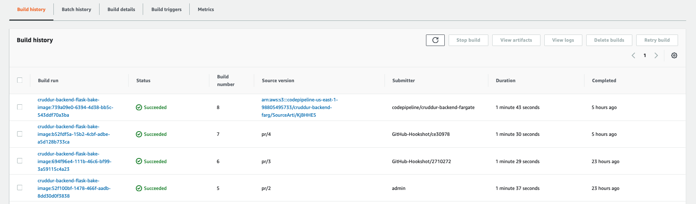
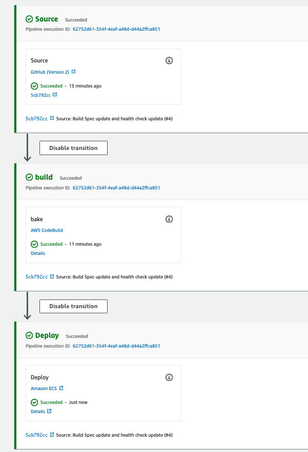

# Week 9 — CI/CD with CodePipeline, CodeBuild and CodeDeploy

## **Configuring CodeBuild**
Configuring CodeBuild was donne via click-ops. I navigated to CodeBuild console and create a new codebuild with the following config
1. Project configuration
    - Project name: cruddur-backend-flask-bake-image1
    - Build badge - optional: Enabled

2. Source
    - Source provider: Github. Followed all prompts to connect to github using OAuth
    - Repository: Repository in my GitHub account
    - GitHub repository: Selected my bootcamp repo
    - Source version - optional: prod (This is a new branch on my repo)

3. Primary source webhook events
    - Webhook - optional: Rebuild every time a code change is pushed to this repository
    - Build type: Single build
    - Event type: PULL_REQUEST_MERGED
4. Environment
    - Environment image: Managed image
    - Operating system: Amazon Linux 2
    - Runtime(s): Standard
    - Image: latest
    I took note of the service role displayed here
5. Buildspec
    - Build specifications: Use a buildspec file
    - Buildspec name - optional: backend-flask/buildspec.yml
6. Logs:
    - CloudWatch logs - optional: checked
    - Group name: /cruddur/build/backend-flask
    - Stream: backend-flask

7. I clicked on Create build project

8. This final change was realized after testing and a failed build. A missing policy is required to allow the build get ecr token. I navigated to IAM and looked through the roles, selected the new role from above and attached the following inline policy:
    ```json
    {
        "Version": "2012-10-17",
        "Statement": [
            {
                "Sid": "VisualEditor0",
                "Effect": "Allow",
                "Action": "ecr:GetDownloadUrlForLayer",
                "Resource": "arn:aws:ecr:us-east-1:401093650699:repository/*"
            },
            {
                "Sid": "VisualEditor1",
                "Effect": "Allow",
                "Action": "ecr:GetAuthorizationToken",
                "Resource": "*"
            }
        ]
    }
    ```

### **Testing**
In the [backend-flask](../backend-flask/) directory, I created a [buildspec.yml](../backend-flask/buildspec.yml) with content: 
```yml
# Buildspec runs in the build stage of your pipeline.
version: 0.2
phases:
  install:
    runtime-versions:
      docker: 20
    commands:
      - echo "cd into $CODEBUILD_SRC_DIR/backend-flask"
      - cd $CODEBUILD_SRC_DIR/backend-flask
      - aws ecr get-login-password --region $AWS_DEFAULT_REGION | docker login --username AWS --password-stdin $IMAGE_URL
  build:
    commands:
      - echo Build started on `date`
      - echo Building the Docker image...          
      - docker build --build-arg image_name=$IMAGE_URL/$PYTHON_REPO:3.10-slim-buster -t backend-flask -f Dockerfile.prod .
      - docker tag $REPO_NAME $IMAGE_URL/$REPO_NAME
  post_build:
    commands:
      - echo Build completed on `date`
      - echo Pushing the Docker image..
      - docker push $IMAGE_URL/$REPO_NAME
      - cd $CODEBUILD_SRC_DIR
      - echo "imagedefinitions.json > [{\"name\":\"$CONTAINER_NAME\",\"imageUri\":\"$IMAGE_URL/$REPO_NAME\"}]" > imagedefinitions.json
      - printf "[{\"name\":\"$CONTAINER_NAME\",\"imageUri\":\"$IMAGE_URL/$REPO_NAME\"}]" > imagedefinitions.json

env:
  variables:
    AWS_ACCOUNT_ID: 401093650699
    CONTAINER_NAME: backend-flask
    IMAGE_URL: 401093650699.dkr.ecr.us-east-1.amazonaws.com
    REPO_NAME: backend-flask:latest
    PYTHON_REPO: cruddur-python
    AWS_DEFAULT_REGION: us-east-1
artifacts:
  files:
    - imagedefinitions.json
```
This change was pushed to main branched and a pull request was made to the prod branch. I merged the change to the prod branch and observed the code build. Please see result below:



## **Configuring CodePipeline**
Back in the pipeline console, created a new pipeline with the following configuration:
1. Pipeline settings
    - Pipeline name: cruddur-backend-fargate
    - Service role

2. Source:
    - Source provider: Github (Version 2)
    - Connection: created connection and named the connection cruddur
    - Repository name: aaminu/aws-bootcamp-cruddur-2023
    - Branch name: Prod

3. Build - optional:
    - Build provider: AWS COdeBuild
    - Region: US East (N. Virginia)
    - Project name: cruddur-backend-flask-bake-image

4. Deploy - optional
    - Deploy provider: Amazon ECS
    - Cluster name: cruddur
    - Service name: backend-flask

I created the pipeline and waited for it to run. Please see result below:



