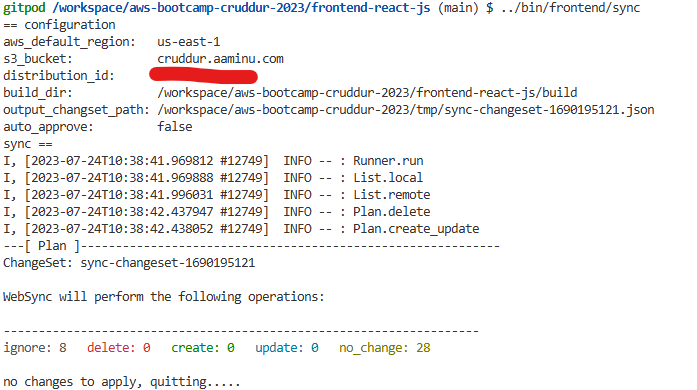

# Week X — Clean Up

## Sync Tool for Static Website Hosting

Setting up the required tool responsible for syncing the static file locted in the S3 Bucket which serves as an origin for the cloudfront distribution, the follow steps were take:

1. Created a [script](../bin/frontend/static-build) to build the static files from the frontend component. Changes were made to the necessary parameters e.g.`REACT_APP_BACKEND_URL`, `REACT_APP_AWS_USER_POOLS_ID`, and `REACT_APP_CLIENT_ID`:
    ```bash
    #! /usr/bin/bash -e 

    CYAN='\033[1;36m'
    NO_COLOR='\033[0m'
    LABEL="Frontend Static Build"
    printf "${CYAN}== ${LABEL}===${NO_COLOR}\n"

    current_file_path=`realpath $0`
    bin_dir=`dirname $(dirname $current_file_path)`
    base_dir=`dirname $bin_dir`
    FRONTEND_REACT_JS_PATH="$base_dir/frontend-react-js"

    echo $FRONTEND_REACT_JS_PATH

    REACT_APP_BACKEND_URL="https://api.cruddur.aaminu.com" \
    REACT_APP_AWS_PROJECT_REGION="$AWS_DEFAULT_REGION" \
    REACT_APP_AWS_COGNITO_REGION="$AWS_DEFAULT_REGION" \
    REACT_APP_AWS_USER_POOLS_ID="$AWS_USER_POOLS_ID" \
    REACT_APP_CLIENT_ID="$COGNITO_APP_CLIENT_ID" \
    npm run build
    ```
2. Changed the permission of the script to allow for it to be executable. To use the script as a standalone, one has to firstly navigate to the [frontend-react-js](../frontend-react-js/) directory in the commandline before executing the script

3. Created a [sync](../bin/frontend/sync) script for the s3 contnent syncing. Changed the permissions to allow executability. To make use of the script, certain installed module and env files are needed, they are detailed in 4, and 5 below:

4. In the commandline, installed aws_s3_website_sync and dotenv by 
    ```bash
    gem install aws_s3_website_sync
    gem install dotenv
    ```
    I also appended both commands to a gitpod task in [.gitpod.yml](../.gitpod.yml)

5. In [erb/](../erb/) directory, I created a new env.erb file ([sync.env.erb](../erb/sync.env.erb)) with the required env vars. In the [bin/frontend/generate-env](../bin/frontend/generate-env) script, I appended the commands required to generate the final sync.env file. I ran the [bin/frontend/generate-env](../bin/frontend/generate-env) in the command line.

6. With everything setup above, I ran the [sync](../bin/frontend/sync) script and the ouput can be seen below:

    


## Reconnect Database and Post Confirmation Lambda
1. Started out by making the necessary changes to the cloudformation templates pushed in this [commit](https://github.com/aaminu/aws-bootcamp-cruddur-2023/commit/47ec58f938cd07c6185475bba603ff15635fcbf4). I executed the changeset and ensured every of the updates completed.

2. I updated the `PROD_CONNECTION_URL` value with the new connection string.
3. In the `CrdDbRDSSG`security group, I added a new inbound rule that accepts ingress from gitpod on port 5432. I also updated the gitpod env-vars `DB_SG_ID` and `DB_SG_RULE_ID` based on the new inbound rule.
4. Ran the [db/connect](../bin/db/connect) script with *prod* argument to ensure every the DB was functioning. I ran the following scripts in the order listed below:
    - [db/schema-load](..bin/db/schema-load) script
    - [db/seed](..bin/db/seed) script
    - [db/update-cognito-user-id](..bin/db/update-cognito-user-id) script
    - [db/migrate](..bin/db/migrate) script 
    Some of the scripts above required passing *prod* as the argument while others required pointing the `CONNECTION_URL` to `PROD_CONNECTION_URL`
5. Refreshing the homepage reveals a working frontend with a single seed data post.
6. Getting the post confirmation lambda to work involved the following steps:
    - New security group `CognitoLambdaSG` with no inbound rule created. Included the new security group as an inbound traffic in `CrdDbRDSSG` on port 5432.
    - In the Lambda function page, I replaced the connection url in the Environment variables of the configuration. 
    - I replaced the old VPC and subnets with the new cloudformation provisioned VPC, subnets, and selected the `CognitoLambdaSG` security group. Setting was saved and allowed to propagate.
7. Tested adding a new account and posting new cruds with success. 


## Other Tasks
All other tasks were performed such as:
- Ensure CI/CD pipeline works
- Refactor to use JWT Decorator in Flask App (In this case, I continued to use the middleware I worte)
- Refactor App.py
- Refactor Flask Routes
- Implement Replies for Posts
- Improved Error Handling for the app
- More General Cleanup.

Futhermore, to get the message to a working state in production, the following was done:
- Ran the migration script on the production postgres database
- Made changes to the the neccesarry CFN stacks e.g the DynamoDB stack was modified so that the lambda processing the stream would know the table name, a machine user was created only for DynamoDB processes.
- Did a static build for the front end and pushed it to CDN
- Finally triggered a codepipline build by doing a PR into prod branch.
